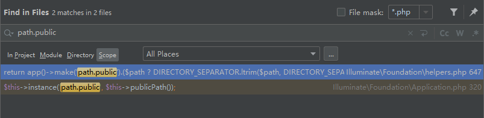

## 第四章：艰难的开始

继续看index.php后面的代码，

```php
$app = require_once __DIR__.'/../bootstrap/app.php';
...
... ...
```

追踪app.php源码：

```php
<?php

/*
|--------------------------------------------------------------------------
| Create The Application
|--------------------------------------------------------------------------
|
| The first thing we will do is create a new Laravel application instance
| which serves as the "glue" for all the components of Laravel, and is
| the IoC container for the system binding all of the various parts.
|
*/

$app = new Illuminate\Foundation\Application(
    $_ENV['APP_BASE_PATH'] ?? dirname(__DIR__)
);

/*
|--------------------------------------------------------------------------
| Bind Important Interfaces
|--------------------------------------------------------------------------
|
| Next, we need to bind some important interfaces into the container so
| we will be able to resolve them when needed. The kernels serve the
| incoming requests to this application from both the web and CLI.
|
*/

$app->singleton(
    Illuminate\Contracts\Http\Kernel::class,
    App\Http\Kernel::class
);

$app->singleton(
    Illuminate\Contracts\Console\Kernel::class,
    App\Console\Kernel::class
);

$app->singleton(
    Illuminate\Contracts\Debug\ExceptionHandler::class,
    App\Exceptions\Handler::class
);

/*
|--------------------------------------------------------------------------
| Return The Application
|--------------------------------------------------------------------------
|
| This script returns the application instance. The instance is given to
| the calling script so we can separate the building of the instances
| from the actual running of the application and sending responses.
|
*/

return $app;

```

>bootstrap/app.php

我们看到$app其实是类Application的一个实例，那么Application类又是怎样定义的呢？通过查看`vendor/laravel/framework/src/Illuminate/Foundation/Application.php`文件的源码，我们能了解到，Application类其实是负责整个应用调度的类，它起到了一个胶水的作用(将Laravel的各个组件粘贴在一起)。这一点，Laravel作者给出了明确的提示：

```php
<?php

/*
|--------------------------------------------------------------------------
| Create The Application
|--------------------------------------------------------------------------
|
| The first thing we will do is create a new Laravel application 
instance
| which serves as the "glue" for all the components of Laravel, and is
| the IoC container for the system binding all of the various parts.
|*/

$app = new Illuminate\Foundation\Application(    $_ENV['APP_BASE_PATH'] ?? dirname(__DIR__));
```

>bootstrap/app.php

serves as the "glue"就是"扮演胶水这个角色"的意思。

我们知道，`$app = new Illuminate\Foundation\Application($_ENV['APP_BASE_PATH'] ?? dirname(__DIR__));` 这行代码，表面上是创建一个Application的实例然后赋值给变量$app，实际上创建Application实例的同时，必然会调用Application类的构造函数。我们猜测，在构造函数中可能会做一些执行MVC之前必须做的基础工作，比如解析URL，初始化参数值等。

因此，我们继续追踪Application类的构造函数：

```php
public function __construct($basePath = null)
{
    if ($basePath) {
        $this->setBasePath($basePath);
    }

    $this->registerBaseBindings();
    $this->registerBaseServiceProviders();
    $this->registerCoreContainerAliases();
}
```

> vendor/laravel/framework/src/Illuminate/Foundation/Application.php

从上到下依次执行了四个主要动作：

- 设置基础目录路径

- 注册基础绑定

- 注册服务提供者

- 注册核心别名类


接下来是就是setBasePath方法：

````php
/**
 * Set the base path for the application.
 *
 * @param  string  $basePath
 * @return $this
 */
public function setBasePath($basePath)
{
    $this->basePath = rtrim($basePath, '\/');

    $this->bindPathsInContainer();

    return $this;
}
````

> vendor/laravel/framework/src/Illuminate/Foundation/Application.php

程序赋值了basePath这个类的成员变量后，执行了另一个方法bindPathsInContainer：

````php
/**
 * Bind all of the application paths in the container.
 *
 * @return void
 */
protected function bindPathsInContainer()
{
    $this->instance('path', $this->path());
    $this->instance('path.base', $this->basePath());
    $this->instance('path.config', $this->configPath());
    $this->instance('path.database', $this->databasePath());
    $this->instance('path.public', $this->publicPath());
    $this->instance('path.resources', $this->resourcePath());
    $this->instance('path.storage', $this->storagePath());
    
    $this->useBootstrapPath(value(function () {
        return is_dir($directory = $this->basePath('.laravel'))
                    ? $directory
                    : $this->basePath('bootstrap');
    }));
    
    $this->useLangPath(value(function () {
        if (is_dir($directory = $this->resourcePath('lang'))) {
            return $directory;
        }

        return $this->basePath('lang');
    }));
}
````

> vendor/laravel/framework/src/Illuminate/Foundation/Application.php

我们看到，这里调用了另一个核心的方法instance，继续追踪：

````php
/**
 * Register an existing instance as shared in the container.
 *
 * @param  string  $abstract
 * @param  mixed   $instance
 * @return mixed
 */
public function instance($abstract, $instance)
{
    $this->removeAbstractAlias($abstract);

    $isBound = $this->bound($abstract);

    unset($this->aliases[$abstract]);

    // We'll check to determine if this type has been bound before, and if it has
    // we will fire the rebound callbacks registered with the container and it
    // can be updated with consuming classes that have gotten resolved here.
    $this->instances[$abstract] = $instance;

    if ($isBound) {
        $this->rebound($abstract);
    }

    return $instance;
}
````

> vendor/laravel/framework/src/Illuminate/Container/Container.php

在这一段代码中，我们把注意力集中到`this->instances[$abstract] = $instance;`这一行上，可以很清楚地看到，代码做的事情，就是简单地给类的成员变量instances(通过后面的操作可以看到该变量实际上是一个数组类型的变量)，添加一个健值对。其中键名是传入的参数$abstract的参数值，键值是另一个参数$instance的参数值。由此，我们可以很清楚地看到，bindPathsInContainer方法，完成了多个路径的"键值对绑定"工作。

> instance方法全部代码的详细解读，请参考【附录二】

那么，在框架需要用到路径的地方，必然会引用到这些键值对。如何验证呢？很简单，使用phpstorm编辑器的快捷键：ctrl + shift + f，全局搜索即可。我们以"path.base"为例，在我们的blog项目中，全局搜索"path.public"，会发现搜索到的结果如下：



【图4.1】

点开EnsureRelativePaths.php文件中的第15行代码，追踪到下面这个方法：

````php
/**
 * Ensures the given string only contains relative paths.
 *
 * @param  string  $string
 * @return string
 */
public function __invoke($string)
{
    if (function_exists('app') && app()->has('path.base')) {
        $string = str_replace(base_path().'/', '', $string);
    }

    return $string;
}
````

> vendor\laravel\framework\src\Illuminate\Console\View\Components\Mutators\EnsureRelativePaths.php

这里，让人感到疑惑的是：为什么获取"path.base"这个"键值"的时候是直接将"path.base"作为参数传入has这个函数的呢？为了弄清楚这个问题，我们继续去追踪app这个函数的具体实现：

````php
/**
 * Get the available container instance.
 *
 * @param  string|null  $abstract
 * @param  array   $parameters
 * @return mixed|\Illuminate\Contracts\Foundation\Application
 */
function app($abstract = null, array $parameters = [])
{
    if (is_null($abstract)) {
        return Container::getInstance();
    }

    return Container::getInstance()->make($abstract, $parameters);
}
````

> vendor\laravel\framework\src\Illuminate\Foundation\helpers.php

显然，我们发现在`app()->has('path.base')`这种方式的调用情况下，代码执行的是if里面的那个return语句。我们继续追踪Container这个类的`getInstance`方法：

getInstance方法：

````php
/**
 * Get the globally available instance of the container.
 *
 * @return static
 */
public static function getInstance()
{
    if (is_null(static::$instance)) {
        static::$instance = new static;
    }

    return static::$instance;
}
````

>vendor/laravel/framework/src/Illuminate/Container/Container.php

这里，我们看到一条比较生僻的php语句：`static::$instance = new static;`。其次，我们发现Container类的$instance变量设置成了静态变量，因此这是一个典型的单例实现(所有引用Container::getInstance()得到的实例，都指向同一个静态成员变量$instance)。

### new static

在一个类中，常见的是new self()操作，代表返回自身类的实例。

当父类中存在方法，然后每个子类继承于父类，调用这个方法会返回自身的实例化对象，如下：

````php
class A {
	function create() {
		return new self();
	}
}

class B extends A {

}

new B()->create(); // 返回类A的实例
````

上例中，调用create方法，总是返回类A的实例。如果要返回调用者类B的实例呢？很简单：

````php
class A {
	function create() {
		return new static();
	}
}

class B extends A {

}

new B()->create(); // 返回类B的实例
````

也就是说，只需要将`new self()`改成`new static()`就行了。上面这种使用static关键字的语法，就是PHP5.3新加入的特性：**延迟静态绑定**，我们可以简单理解为：由调用者来决定static后的对象该指向谁(谁调用就指向谁)，和传统的static属性和方法不同，这里static指向的对象不能在编译阶段就确定下来，必须要等到执行阶段才能确定下来，所以叫"**延迟静态绑定**"。

### make方法

既然getInstance方法返回的是Container自身，那么找到has方法就很简单了，直接在Container.php中查找"function has"即可：

````php
/**
 * {@inheritdoc}
 *
 * @return bool
 */
public function has(string $id): bool
{
    return $this->bound($id);
}
````

> vendor/laravel/framework/src/Illuminate/Container/Container.php

继续追踪bound方法：

````php
/**
 * Determine if the given abstract type has been bound.
 *
 * @param  string  $abstract
 * @return bool
 */
public function bound($abstract)
{
    return isset($this->bindings[$abstract]) ||
           isset($this->instances[$abstract]) ||
           $this->isAlias($abstract);
}
````

> vendor/laravel/framework/src/Illuminate/Container/Container.php

通过阅读，我们很容易发现，下面这一小段代码，正是我们要找的部分：

````php
isset($this->instances[$abstract])
}
````

> vendor/laravel/framework/src/Illuminate/Container/Container.php

在前面基础路径的设置部分，代码正是将路径信息保存在了容器对象的成员变量instances中。

现在我们就来回答前面提到的问题：为什么获取path.base这个"键值"的时候是直接将path.base作为参数传入app这个函数的？

大家可以回到本章引用的【图4.1】，从这个图中，可以很明显得看到有php语句将"path.base"传递给了instance方法。而instance方法会把这个传入的字符串作为键名存储到容器对象的成员变量instances中。当再次使用make方法获取这个键名对应的值时，是优先从容器对象的成员变量instances数组中获取，检测到有这个键名并且当前无需上下文构建时直接返回这个保存的键值。

至此，我们终于理解了四个动作中的第一个动作：设置基础目录路径。这一步完成之后，以后框架需要使用到基础路径的地方都会和这里产生联系。我们终于迈出了第一步。