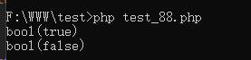
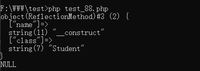
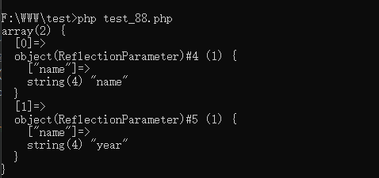

# 第五章：陷入困境

回顾第四章中我们讲到的Application类的构造函数，现在四个主要动作还剩下三个：

- ~~设置基础目录路径~~

- 注册基础绑定
- 注册服务提供者
- 注册核心别名类

尽管标题看起来有点吓人，但是Laravel的作者确实像是给我们出了一道又一道数学谜题，光靠脑筋急转弯根本不足以应对这突如其来的

迷宫一样的"代码阵"。言归正传，我们来看第二个动作：注册基础绑定，它对应的代码是下面这一行：

````php
$this->registerBaseBindings();
````

我们直接追踪这个方法的详细实现：

````php
/**
 * Register the basic bindings into the container.
 *
 * @return void
 */
protected function registerBaseBindings()
{
    static::setInstance($this);

    $this->instance('app', $this);
    $this->instance(Container::class, $this);
    $this->singleton(Mix::class);

    $this->instance(PackageManifest::class, new PackageManifest(
        new Filesystem, $this->basePath(), $this->getCachedPackagesPath()
    ));
}
````

> vendor/laravel/framework/src/Illuminate/Foundation/Application.php

在这个方法中，第一行是调用了类本身定义的一个静态方法setInstance:

````php
/**
 * Set the shared instance of the container.
 *
 * @param  \Illuminate\Contracts\Container\Container|null  $container
 * @return \Illuminate\Contracts\Container\Container|static
 */
public static function setInstance(ContainerContract $container = null)
{
    return static::$instance = $container;
}
````

> vendor/laravel/framework/src/Illuminate/Foundation/Application.php

这个方法很简单，就是对类自身的静态成员变量instance进行初始化操作。实际上，instance就是"容器"的一个共享实例，这一点作者在代码注释中也有说明：Set the shared instance of the container.

之后，继续调用instance方法，将"容器"本身挂载到instances数组的"app"键上，也同时挂载在"Container"键上。之后，注册一个共享变量Mix。我们来重点关注下singleton方法：

````php
/**
 * Register a shared binding in the container.
 *
 * @param  string  $abstract
 * @param  \Closure|string|null  $concrete
 * @return void
 */
public function singleton($abstract, $concrete = null)
{
    $this->bind($abstract, $concrete, true);
}
````

> vendor/laravel/framework/src/Illuminate/Container/Container.php

继续追踪bind方法：

````php
/**
 * Register a binding with the container.
 *
 * @param  string  $abstract
 * @param  \Closure|string|null  $concrete
 * @param  bool  $shared
 * @return void
 */
public function bind($abstract, $concrete = null, $shared = false)
{
    $this->dropStaleInstances($abstract);

    // If no concrete type was given, we will simply set the concrete type to the
    // abstract type. After that, the concrete type to be registered as shared
    // without being forced to state their classes in both of the parameters.
    if (is_null($concrete)) {
        $concrete = $abstract;
    }

    // If the factory is not a Closure, it means it is just a class name which is
    // bound into this container to the abstract type and we will just wrap it
    // up inside its own Closure to give us more convenience when extending.
    if (! $concrete instanceof Closure) {
        $concrete = $this->getClosure($abstract, $concrete);
    }

    $this->bindings[$abstract] = compact('concrete', 'shared');

    // If the abstract type was already resolved in this container we'll fire the
    // rebound listener so that any objects which have already gotten resolved
    // can have their copy of the object updated via the listener callbacks.
    if ($this->resolved($abstract)) {
        $this->rebound($abstract);
    }
}
````

> vendor/laravel/framework/src/Illuminate/Container/Container.php

在这个部分，核心的代码是下面这一句：

````php
$this->bindings[$abstract] = compact('concrete', 'shared');
````

> bind方法的详细解说，参考【附录四】

通过和instance方法比较，我们发现：bindings数组绑定的键名容易理解(绑定什么键根据传入的参数来定)，键值却并不容易理解。大家可以看到，在这一行中，键值使用了一个compact函数，这个函数的作用和extract函数刚好相反。这里我们解释为：`compact('concrete', 'shared')`返回的是一个数组，数组包含两个键值对，一个键值对为：`['concrete' => 变量$concrete的值]`，另一个键值对为：`['shared' => 变量$shared的值]`。当然前提是两个变量都存在值，如果变量不存在，则忽略这个键值对。

这样，我们必然会去关注$concrete这个变量的值是如何得到的，也就是下面这几行关键的代码：

````php
if (! $concrete instanceof Closure) {
    $concrete = $this->getClosure($abstract, $concrete);
}
````

继续追踪getClosure方法的实现：

````php
/**
 * Get the Closure to be used when building a type.
 *
 * @param  string  $abstract
 * @param  string  $concrete
 * @return \Closure
 */
protected function getClosure($abstract, $concrete)
{
    return function ($container, $parameters = []) use ($abstract, $concrete) {
        if ($abstract == $concrete) {
            return $container->build($concrete);
        }

        return $container->resolve(
            $concrete, $parameters, $raiseEvents = false
        );
    };
}    
````

> vendor/laravel/framework/src/Illuminate/Container/Container.php

## 闭包

这里，我们再次碰到一个比较生僻的用法：**闭包**，抛开闭包的使用方法不太好理解不谈。容易让人困惑的是，为什么这里要返回一个闭包？

要明白这一点，我们需要从一个实际的案例出发：

```php
<?php
namespace App\Http\Controllers;

use Illuminate\Http\Request;

class Money
{
    private $amount = 0;
    public function __construct($amount)
    {
        $this->amount = $amount;
    }

    public function getAmount()
    {
        return $this->amount;
    }
}


class HomeController extends Controller
{
    
    public function index()
    {
        app()->bind('money', function(){return new Money(0.21);});
        $a = app()->make('money');
        var_dump($a);
        return json_encode(['a'=>1,'b'=>2]);
    }
}
````

> app/Http/Controllers/HomeController.php

我们新建一个HomeController，然后在路由文件中定义一个路由：

```php
Route::get('/home', 'HomeController@index');
```

在浏览器中访问下面这个URL：http://dev.blog.z/home， 结果是这样的：

```
object(App\Http\Controllers\Money)#240 (1) { ["amount":"App\Http\Controllers\Money":private]=> float(0.21) } {"a":1,"b":2}
```

在Laravel框架中，使用到singleton方法操作的类，其底层都是先经过bind方法将关键字和要实现的闭包存储在容器的bindings成员变量中后，在需要使用类的地方再调用make方法将这个关键字对应的类解析出来。

这里还需要注意的一点是，singleton方法操作关键字时，这个关键字对应的类会设置为全局共享，在make方法首次解析类时会创建一次类实例，之后再次调用就直接从容器对象的bindings数组中取对应值了。关于这一点，可以参考【附录三】。

从上面这个实例，我们能看到，我们无需先创建出一个实际的对象，而只需要先保存生成这个对象的闭包。之后在需要调用的地方再调用make方法就能成功解析出需要的对象。这样做的好处有很多，比如：

1）不用事先创建好对象，在需要用到该类的地方才创建。这有助于应用在"准备启动"的阶段节省内存。

2）能更方便地控制对象的创建和获取，比如resovle方法中实现的各种方式的对象解析：1、singleton单例(首次创建，之后缓存)；2、扩展；3、回调事件触发。

到目前为止，我们只是解释了为什么这个函数要返回闭包。闭包里面的两个实现，build和resolve这两个方法还需要继续分析：

build:

````php
/**
 * Instantiate a concrete instance of the given type.
 *
 * @param  string  $concrete
 * @return mixed
 *
 * @throws \Illuminate\Contracts\Container\BindingResolutionException
 */
public function build($concrete)
{
    // If the concrete type is actually a Closure, we will just execute it and
    // hand back the results of the functions, which allows functions to be
    // used as resolvers for more fine-tuned resolution of these objects.
    if ($concrete instanceof Closure) {
        return $concrete($this, $this->getLastParameterOverride());
    }

    $reflector = new ReflectionClass($concrete);

    // If the type is not instantiable, the developer is attempting to resolve
    // an abstract type such as an Interface or Abstract Class and there is
    // no binding registered for the abstractions so we need to bail out.
    if (! $reflector->isInstantiable()) {
        return $this->notInstantiable($concrete);
    }

    $this->buildStack[] = $concrete;

    $constructor = $reflector->getConstructor();

    // If there are no constructors, that means there are no dependencies then
    // we can just resolve the instances of the objects right away, without
    // resolving any other types or dependencies out of these containers.
    if (is_null($constructor)) {
        array_pop($this->buildStack);

        return new $concrete;
    }

    $dependencies = $constructor->getParameters();

    // Once we have all the constructor's parameters we can create each of the
    // dependency instances and then use the reflection instances to make a
    // new instance of this class, injecting the created dependencies in.
    try {
        $instances = $this->resolveDependencies($dependencies);
    } catch (BindingResolutionException $e) {
        array_pop($this->buildStack);

        throw $e;
    }

    array_pop($this->buildStack);

    return $reflector->newInstanceArgs($instances);
}
````

> vendor/laravel/framework/src/Illuminate/Container/Container.php

## 反射

上面这段代码，再次使用了PHP中比较生僻的用法：**反射**。什么场景下，我们需要使用反射呢？比如，我们事先定义好了一个类，类中包含类的各个成员变量的定义和初始化，类的构造方法，公有方法和私有方法、保护方法等等。此时，仅告诉你一个类名而不告诉你类中的任何细节，你如何才能完成实例化类的任务呢？因为类的实例化过程中，可能涉及到构造函数的调用，而构造函数的调用过程又可能需要传参。如果不使用反射，根本无从下手，有了反射就好办了。

关于反射的详细资料，可以阅读PHP手册上的这个链接：https://www.php.net/manual/zh/book.reflection.php

接下来，我们结合一个实例，来理解这部分代码中所有和反射有关的类和方法。

````php
<?php
    
abstract class C 
{
    
}

class  Printer
{
}

class  Student
{
    private $name;
    private $year;

    public function __construct($name, $year)
    {
        $this->name = $name;
        $this->year = $year;
    }

    public function getValue()
    {
        return $this->name;
    }

    public function setBase(Printer $printer, $name, $year = 10)
    {
        $this->name = $name;
        $this->year = $year;
    }
}
````

首先我们将上面的代码单独保存为一个php文件，命名为base.php。然后我们再编写一个test_88.php的测试文件，代码如下：

````php
<?php
require 'base.php';

$reflector = new ReflectionClass(Student::class);
$reflector_ = new ReflectionClass(C::class);

$bool = $reflector->isInstantiable();
$bool_ = $reflector_->isInstantiable();
var_dump($bool);
var_dump($bool_);
exit;
````



【图5.1】

> isInstantible方法是检测对象能否实例化的，能则返回true，不能则返回false

接下来我们继续改写test_88.php：

````php
<?php
require 'base.php';

$reflector = new ReflectionClass(Student::class);
$reflector_ = new ReflectionClass(C::class);

$constructor = $reflector_->getConstructor();
$constructor_ = $reflector_->getConstructor();
var_dump($constructor);
var_dump($constructor_);
exit;
````



【图5.2】

> getConstructor方法返回对象的构造函数信息，如果对象没有定义构造函数，则返回NULL

继续改写test_88.php：

````php
<?php
require 'base.php';

$reflector = new ReflectionClass(Student::class);
$reflector_ = new ReflectionClass(C::class);

$constructor = $reflector->getConstructor();
$dependencies = $constructor->getParameters();
var_dump($dependencies);
exit;
````



【图5.3】

> $constructor的getParameters方法返回构造函数需要的参数信息

最后一个方法newInstanceArgs，是利用反射类，直接实例化一个类。当然，我们事先需要先处理构造函数的参数。

我们回头再重新看build方法：

```php
/**
 * Instantiate a concrete instance of the given type.
 *
 * @param  string  $concrete
 * @return mixed
 *
 * @throws \Illuminate\Contracts\Container\BindingResolutionException
 */
public function build($concrete)
{
    // If the concrete type is actually a Closure, we will just execute it and
    // hand back the results of the functions, which allows functions to be
    // used as resolvers for more fine-tuned resolution of these objects.
    if ($concrete instanceof Closure) {
        return $concrete($this, $this->getLastParameterOverride());
    }

    $reflector = new ReflectionClass($concrete);

    // If the type is not instantiable, the developer is attempting to resolve
    // an abstract type such as an Interface or Abstract Class and there is
    // no binding registered for the abstractions so we need to bail out.
    if (! $reflector->isInstantiable()) {
        return $this->notInstantiable($concrete);
    }

    $this->buildStack[] = $concrete;

    $constructor = $reflector->getConstructor();

    // If there are no constructors, that means there are no dependencies then
    // we can just resolve the instances of the objects right away, without
    // resolving any other types or dependencies out of these containers.
    if (is_null($constructor)) {
        array_pop($this->buildStack);

        return new $concrete;
    }

    $dependencies = $constructor->getParameters();

    // Once we have all the constructor's parameters we can create each of the
    // dependency instances and then use the reflection instances to make a
    // new instance of this class, injecting the created dependencies in.
    try {
        $instances = $this->resolveDependencies($dependencies);
    } catch (BindingResolutionException $e) {
        array_pop($this->buildStack);

        throw $e;
    }

    array_pop($this->buildStack);

    return $reflector->newInstanceArgs($instances);
}
```

> vendor/laravel/framework/src/Illuminate/Container/Container.php

现在我们应该能大体上理解这段代码的含义了，其实这里就是根据传入的concrete参数构造出需要实例化的对象并返回。当然，处理构造函数需要的参数这里，框架自定义了单独的方法：resolveDependencies。这个方法的详细分析，请参考【附录五】。

看完build方法后，再来看另一个方法resolve：

````php
/**
 * Resolve the given type from the container.
 *
 * @param  string  $abstract
 * @param  array  $parameters
 * @param  bool   $raiseEvents
 * @return mixed
 *
 * @throws \Illuminate\Contracts\Container\BindingResolutionException
 */
protected function resolve($abstract, $parameters = [], $raiseEvents = true)
{
    $abstract = $this->getAlias($abstract);

    $needsContextualBuild = ! empty($parameters) || ! is_null(
        $this->getContextualConcrete($abstract)
    );

    // If an instance of the type is currently being managed as a singleton we'll
    // just return an existing instance instead of instantiating new instances
    // so the developer can keep using the same objects instance every time.
    if (isset($this->instances[$abstract]) && ! $needsContextualBuild) {
        return $this->instances[$abstract];
    }

    $this->with[] = $parameters;

    $concrete = $this->getConcrete($abstract);

    // We're ready to instantiate an instance of the concrete type registered for
    // the binding. This will instantiate the types, as well as resolve any of
    // its "nested" dependencies recursively until all have gotten resolved.
    if ($this->isBuildable($concrete, $abstract)) {
        $object = $this->build($concrete);
    } else {
        $object = $this->make($concrete);
    }

    // If we defined any extenders for this type, we'll need to spin through them
    // and apply them to the object being built. This allows for the extension
    // of services, such as changing configuration or decorating the object.
    foreach ($this->getExtenders($abstract) as $extender) {
        $object = $extender($object, $this);
    }

    // If the requested type is registered as a singleton we'll want to cache off
    // the instances in "memory" so we can return it later without creating an
    // entirely new instance of an object on each subsequent request for it.
    if ($this->isShared($abstract) && ! $needsContextualBuild) {
        $this->instances[$abstract] = $object;
    }

    if ($raiseEvents) {
        $this->fireResolvingCallbacks($abstract, $object);
    }

    // Before returning, we will also set the resolved flag to "true" and pop off
    // the parameter overrides for this build. After those two things are done
    // we will be ready to return back the fully constructed class instance.
    $this->resolved[$abstract] = true;

    array_pop($this->with);

    return $object;
}
````

> vendor/laravel/framework/src/Illuminate/Container/Container.php

resolve方法中的代码，包含的信息量太大了，这种情况正是因为框架提供了很多丰富的特性：扩展，单例模式的绑定对象具有缓存特性(只在第一次调用时创建对象，后面都从缓存中直接读取对象)等等，这个方法的详细分析请参考【附录三】。


## 题外话

本章标题之所以取名为陷入困境，是因为框架在这个阶段使用了很多生僻的用法：反射、闭包等，这多少会让初学者感到困惑，对框架的广泛流行也是不利的（好在这些都只是表象，整体来说Laravel的设计仍然是优秀的并且值得每一个phper深入学习）。

如果你看过早期流行的php框架CI(CodeIgniter)的源码，一定会感同深受。因为CI并没有使用太多冷门的语法，甚至连反射都没有用到，仅仅是结合"引用"和"自动加载函数"(__autoload)的功能，CI出色地完成了MVC模式的搭建。

在CI的时代里，PHP简单又不失优雅，成为了名副其实的**代码点火器**。今天，CI依然拥有大量的拥趸，因为php程序员坚信：好的框架不是代码要多么晦涩难懂，功能如何强大可扩展。更重要的，是文档齐全、结构精巧、性能出色，而CI确实满足了这些要求。

说到这里，可能有读者会觉得作者似乎已经偏离了预定的行文轨道，原本分析Laravel生命周期的文章，到这里竟然将Laravel和CI做起了比较，甚至于不吝赞美CI的简单优雅去了。

既然如此，我们不妨进一步将CI和Laravel做个比较。因为大家在实际的开发过程中，一定会面临框架的选择，这个问题是非解决不可的，不是吗？

先来说CI，CI最大的特点就是简单、易上手。配合官方提供的中文文档，你可以很快就上手编写代码。并且它的核心代码少，占用空间和Laravel比起来少多了。但是也因为简单，当项目稍微变得功能多一点的时候，它的问题就暴露出来了：

- 默认的CI框架并没有集成composer，需要你自己去规划目录。当然这对于一个熟悉PHP的人来说难度很小；
- CI没有提供一个命令行式的框架交互入口，这对于一个擅长在命令行下做开发的人来说简直就是灾难。如果你不能使用命令行，那就意味着，你每次要新建一个model，都只能在IDE中操作鼠标，右键选择菜单。。。而命令行下，只要一条命令便可以快速创建controller、model等各种文件；
- CI的路由功能显然没有Laravel的路由功能强大，Laravel的路由类天然支持中间件、正则匹配、命名、路由分组等常用功能，在CI中你必须手动去自己实现；
- 在大型项目的开发中，Eloquent ORM几乎是框架的必选项，然而CI并没有。同样地，在很多场景中需要使用到的队列、任务调度、数据库迁移。。。CI均不支持；
- 在安全方面，Laravel天然支持防CSRF/XSS攻击。CI框架默认也没有相应的支持。

当然，你只要深入地学习过CI，就能清晰地认识到，CI框架在构建过程中并没有很多"面向对象"高级技巧方面的应用。比如Laravel服务容器天然支持的"依赖注入"，"门面"(Facade)等等。

言归正传，本章我们最后简单归纳一下，这一章我们重点分析的是上一章中四个主要动作中的第二个动作：注册基础绑定。它对应的是Application构造函数中的这条语句：`$this->registerBaseBindings();`

在追踪代码的过程中，我们重点分析了getClosure方法：

````php
protected function getClosure($abstract, $concrete)
{
	return function ($container, $parameters = []) use ($abstract, $concrete) {
		if ($abstract == $concrete) {
			return $container->build($concrete);
		}

		return $container->resolve(
			$concrete, $parameters, $raiseEvents = false
		);
	};
}
````

> vendor/laravel/framework/src/Illuminate/Container/Container.php

getClosure方法中代码逻辑可以简单理解为：根据参数$abstract和$concrete的值，分为两种情况去处理：

- 一种是调用build方法，这个方法中的代码可能用到反射去反向构建类。
- 另一种是调用resolve方法，直接从container中解析出相应的类。