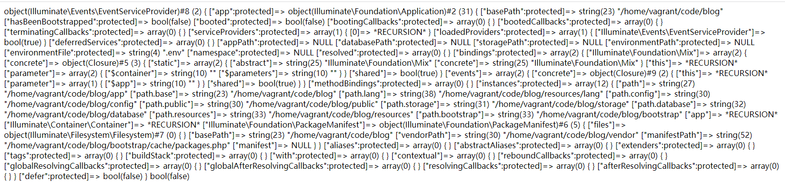
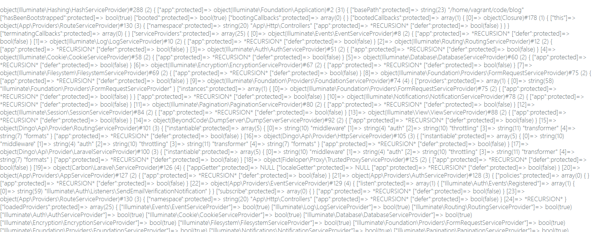

#  第六章：继续前行

我们继续分析第四章中提到的四个主要动作中的第三个动作：注册服务提供者，

- ~~设置基础目录路径~~

- ~~注册基础绑定~~
- 注册服务提供者
- 注册核心别名类

对应的是下面这行代码：

````php
$this->registerBaseServiceProviders();
````

追踪这个方法的具体实现：

````php
/**
 * Register all of the base service providers.
 *
 * @return void
 */
protected function registerBaseServiceProviders()
{
    $this->register(new EventServiceProvider($this));
    $this->register(new LogServiceProvider($this));
    $this->register(new RoutingServiceProvider($this));
}    
````

> vendor/laravel/framework/src/Illuminate/Foundation/Application.php

继续追踪register：

````php
/**
 * Register a service provider with the application.
 *
 * @param  \Illuminate\Support\ServiceProvider|string  $provider
 * @param  bool   $force
 * @return \Illuminate\Support\ServiceProvider
 */
public function register($provider, $force = false)
{
    if (($registered = $this->getProvider($provider)) && ! $force) {
        return $registered;
    }

    // If the given "provider" is a string, we will resolve it, passing in the
    // application instance automatically for the developer. This is simply
    // a more convenient way of specifying your service provider classes.
    if (is_string($provider)) {
        $provider = $this->resolveProvider($provider);
    }

    $provider->register();

    // If there are bindings / singletons set as properties on the provider we
    // will spin through them and register them with the application, which
    // serves as a convenience layer while registering a lot of bindings.
    if (property_exists($provider, 'bindings')) {
        foreach ($provider->bindings as $key => $value) {
            $this->bind($key, $value);
        }
    }

    if (property_exists($provider, 'singletons')) {
        foreach ($provider->singletons as $key => $value) {
            $this->singleton($key, $value);
        }
    }

    $this->markAsRegistered($provider);

    // If the application has already booted, we will call this boot method on
    // the provider class so it has an opportunity to do its boot logic and
    // will be ready for any usage by this developer's application logic.
    if ($this->isBooted()) {
        $this->bootProvider($provider);
    }

    return $provider;
}
````

> vendor/laravel/framework/src/Illuminate/Foundation/Application.php

要通读这个方法的所有代码，请参考【附录六】。在这一章中，我们关注的核心代码是下面这句：

````php
$provider->register();
````

即register方法的主要动作，就是执行provider对象本身的register方法，然后就返回对象实例本身了。于是我们继续追踪provider对象身上的register方法。由于provider对象指向哪个实例是不确定(由传入的参数决定)的，因此我们以第一个EventServiceProvider为例，进入这个类中，继续去追踪它的register方法：

````php
/**
 * Register the service provider.
 *
 * @return void
 */
public function register()
{
    $this->app->singleton('events', function ($app) {
        return (new Dispatcher($app))->setQueueResolver(function () use ($app) {
            return $app->make(QueueFactoryContract::class);
        });
    });
}
````

> vendor/laravel/framework/src/Illuminate/Events/EventServiceProvider.php

我们看到，register方法，执行了一次singleton，singleton方法我们在第五章中已经讲解过，它的主要作用就是往app这个共享的容器身上挂载键值对。这里，我们看到events这个"键"再次被挂载到一个闭包值上了。

除此之外，我们还要重点关注一下，实例化provider的过程中，provider类的构造函数执行了什么，我们发现构造函数在父类\Illuminate\Support\ServiceProvider中：

````php
/**
 * Create a new service provider instance.
 *
 * @param  \Illuminate\Contracts\Foundation\Application  $app
 * @return void
 */
public function __construct($app)
{
    $this->app = $app;
}
````

> vendor/laravel/framework/src/Illuminate/Support/ServiceProvider.php

我们看到，这里只是简单地将传入的app变量值赋值给类的成员变量app。查看每个provider的register方法，你会发现，它们都是使用`$this->app->singleton...`这种方式去实现具体的register动作。我们看到，不管框架在"注册基础服务提供者"这个步骤中执行了多少次register，最后这些注册的服务类，都会被容器app"接收"，将来也是通过调用app去进行具体的实现。

此外，还值得注意的是，我们发现了下面这段代码：

````php
if ($this->isBooted()) {
	$this->bootProvider($provider);
}
````

大家可以通过"var_dump中断测试"(参考【附录一】)来测试一下，在默认情况下，注册第一个EventServiceProvider时，`$this->isBooted()`这里返回值是false。

也就是说，最开始register的时候，并没有走到这个if里面去。然而在if里面加exit语句，刷新应用主页时，代码却能成功进入到if中去。

如下，我们进行两次var_dump中断测试：

第一次：

````php
var_dump($provider);
var_dump($this->isBooted());
exit;
if ($this->isBooted()) {
	$this->bootProvider($provider);
}
````

输出结果：



【图6.1】

第二次：

````php
if ($this->isBooted()) {
	var_dump($provider);exit('ccc');
	$this->bootProvider($provider);
}
````

输出结果：



【图6.2】

由于输出的字符串太长，我们仅截取部分显示在这里。

很明显，register方法至少被执行了两次：一次是应用启动时，一次是应用启动后。而且我们发现了一个比较奇怪的现象：第二次var_dump中断测试时页面要加载较长时间才能运行完成(对比第一次有明显的延时)。这是什么原因造成的呢？

要了解事情的真相，还得从var_dump打印的内容开始入手，按照我们的猜想，应用启动后，输出一个provider对象信息后，程序马上就退出(exit)了，没有道理有这么明显的延时。

现在我们来仔细查看var_dump语句输出的内容：

````php
object(Illuminate\Hashing\HashServiceProvider)#288 (2) {
  ["app":protected]=>
  object(Illuminate\Foundation\Application)#2 (31) {
    ["basePath":protected]=>
    string(23) "/home/vagrant/code/blog"
    ["hasBeenBootstrapped":protected]=>
    bool(true)
    ["booted":protected]=>
    bool(true)
    ["bootingCallbacks":protected]=>
    array(0) {
    }
    ["bootedCallbacks":protected]=>
    array(1) {
      [0]=>
      object(Closure)#178 (1) {
        ["this"]=>
        object(App\Providers\RouteServiceProvider)#130 (3) {
          ["namespace":protected]=>
          string(20) "App\Http\Controllers"
          ["app":protected]=>
          *RECURSION*
          ["defer":protected]=>
          bool(false)
        }
      }
    }
    ["terminatingCallbacks":protected]=>
    array(0) {
    }
    ["serviceProviders":protected]=>
    array(25) {
      [0]=>
      object(Illuminate\Events\EventServiceProvider)#8 (2) {
        ["app":protected]=>
        *RECURSION*
        ["defer":protected]=>
        bool(false)
      }
      [1]=>
      object(Illuminate\Log\LogServiceProvider)#10 (2) {
        ["app":protected]=>
        *RECURSION*
        ["defer":protected]=>
        bool(false)
      }
      [2]=>
      ...
      ... ...
````

我们看到，HashServiceProvider对象里面包含app保护成员，这个保护成员正好就是全局唯一的容器对象，并且在很多其他地方我们都看到了：\*RECURSION\*。这是因为每一个ServiceProvider类型的对象都会将app这个容器放到自己的app保护成员变量上，这实际上造成了多次的递归引用。

>这里的"ServiceProvider类型"的对象，是指所有服务提供者类的实例，这些服务提供者类有一个共同的特征，就是都继承了`\Illuminate\Support\ServiceProvider`类。

从app容器这个对象的内容来看，我们发现在应用启动后，app包含了很多provider类型的对象。通过查看isBooted方法的源码，我们能梳理出app的保护成员变量booted是什么时候从false变成true的。在phpstorm IDE中全局搜索"->booted"，我们能看到，正是在boot方法之后，booted值被赋值为了true：

````php
/**
 * Boot the application's service providers.
 *
 * @return void
 */
public function boot()
{
    if ($this->isBooted()) {
        return;
    }

    // Once the application has booted we will also fire some "booted" callbacks
    // for any listeners that need to do work after this initial booting gets
    // finished. This is useful when ordering the boot-up processes we run.
    $this->fireAppCallbacks($this->bootingCallbacks);

    array_walk($this->serviceProviders, function ($p) {
        $this->bootProvider($p);
    });

    $this->booted = true;

    $this->fireAppCallbacks($this->bootedCallbacks);
}
````

> vendor/laravel/framework/src/Illuminate/Foundation/Application.php

上面的代码显示：应用启动后，会逐个去运行每个ServiceProvider类型对象的bootProvider方法。

这样我们就明白了：在应用启动之前，app容器已经"接收"完了所有的ServiceProvider类型对象，而每个ServiceProvider类型对象的保护成员app又都指向了容器本身，这必然造成大量的递归引用。所以这时候打印一个provider对象的信息就不是那么容易的事情。这里我们可以简单分析一下：程序先调用语句创建出一个对象A，对象A调用语句创建出对象B，同时把A本身注入到B中去，这时代码中一共包含了3个对象的信息：A，A.B,  A.B.A（最后这个A.B.A就是递归引用了）。继续调用语句创建出对象C，情况变成了：A, A.B, A.C, A.B.A, A.C.A。即此时变成了5个对象，其中包含两个递归引用。即我们每多注册一个ServiceProvider，对象数量就增加2，并且多一个递归引用。而在我们的配置文件`config/app.php`文件中定义了多个需要注册的providers：

```php
'providers' => [
	/*
	* Laravel Framework Service Providers...
	*/
	Illuminate\Auth\AuthServiceProvider::class,
	Illuminate\Broadcasting\BroadcastServiceProvider::class,
	Illuminate\Bus\BusServiceProvider::class,
	Illuminate\Cache\CacheServiceProvider::class,
	Illuminate\Foundation\Providers\ConsoleSupportServiceProvider::class,
	Illuminate\Cookie\CookieServiceProvider::class,
	Illuminate\Database\DatabaseServiceProvider::class,
	Illuminate\Encryption\EncryptionServiceProvider::class,
	Illuminate\Filesystem\FilesystemServiceProvider::class,
	Illuminate\Foundation\Providers\FoundationServiceProvider::class,
	Illuminate\Hashing\HashServiceProvider::class,
	Illuminate\Mail\MailServiceProvider::class,
	Illuminate\Notifications\NotificationServiceProvider::class,
	Illuminate\Pagination\PaginationServiceProvider::class,
	Illuminate\Pipeline\PipelineServiceProvider::class,
	Illuminate\Queue\QueueServiceProvider::class,
	Illuminate\Redis\RedisServiceProvider::class,
	Illuminate\Auth\Passwords\PasswordResetServiceProvider::class,
	Illuminate\Session\SessionServiceProvider::class,
	Illuminate\Translation\TranslationServiceProvider::class,
	Illuminate\Validation\ValidationServiceProvider::class,
	Illuminate\View\ViewServiceProvider::class,

	/*
	* Package Service Providers...
	*/

	/*
	* Application Service Providers...
	*/
	App\Providers\AppServiceProvider::class,
	App\Providers\AuthServiceProvider::class,
	// App\Providers\BroadcastServiceProvider::class,
	App\Providers\EventServiceProvider::class,
	App\Providers\RouteServiceProvider::class,

],
```

> 当然还需要加上系统默认注册的3个ServiceProvider类型的类，才是总的需要注册的Providers数。

通过前面var_dump的输出，我们能发现除了ServiceProvider类型类的注册会造成递归引用外，容器其他的一些成员变量(保存回调事件的成员)保存的闭包中，也包含了递归引用。因此，即使是打印一个对象的信息，也可能造成浏览器内存溢出，导致最后打印失败。

读者可能会问这样一个问题，为什么Laravel在不中断的情况输出首页又没有这么明显的延时呢？

答案很简单：var_dump打印某个对象的信息很慢，但是执行对象上的方法却可以很快。就像"我们去拆解一辆汽车的所有零部件，将这些零部件的信息完整呈现出来需要耗费大量时间，但是点火启动汽车却可能不到1秒"一样。

接下来，我们分析最后一个动作：注册核心别名类。

- ~~设置基础目录路径~~

- ~~注册基础绑定~~
- ~~注册服务提供者~~
- 注册核心别名类

对应的是下面这行代码：

````php
$this->registerCoreContainerAliases();
````

继续追踪registerCoreContainerAliases方法：

````php
/**
 * Register the core class aliases in the container.
 *
 * @return void
 */
public function registerCoreContainerAliases()
{
    foreach ([
        'app'                  => [self::class, \Illuminate\Contracts\Container\Container::class, \Illuminate\Contracts\Foundation\Application::class, \Psr\Container\ContainerInterface::class],
        'auth'                 => [\Illuminate\Auth\AuthManager::class, \Illuminate\Contracts\Auth\Factory::class],
        'auth.driver'          => [\Illuminate\Contracts\Auth\Guard::class],
        'blade.compiler'       => [\Illuminate\View\Compilers\BladeCompiler::class],
        'cache'                => [\Illuminate\Cache\CacheManager::class, \Illuminate\Contracts\Cache\Factory::class],
        'cache.store'          => [\Illuminate\Cache\Repository::class, \Illuminate\Contracts\Cache\Repository::class],
        'config'               => [\Illuminate\Config\Repository::class, \Illuminate\Contracts\Config\Repository::class],
        'cookie'               => [\Illuminate\Cookie\CookieJar::class, \Illuminate\Contracts\Cookie\Factory::class, \Illuminate\Contracts\Cookie\QueueingFactory::class],
        'encrypter'            => [\Illuminate\Encryption\Encrypter::class, \Illuminate\Contracts\Encryption\Encrypter::class],
        'db'                   => [\Illuminate\Database\DatabaseManager::class],
        'db.connection'        => [\Illuminate\Database\Connection::class, \Illuminate\Database\ConnectionInterface::class],
        'events'               => [\Illuminate\Events\Dispatcher::class, \Illuminate\Contracts\Events\Dispatcher::class],
        'files'                => [\Illuminate\Filesystem\Filesystem::class],
        'filesystem'           => [\Illuminate\Filesystem\FilesystemManager::class, \Illuminate\Contracts\Filesystem\Factory::class],
        'filesystem.disk'      => [\Illuminate\Contracts\Filesystem\Filesystem::class],
        'filesystem.cloud'     => [\Illuminate\Contracts\Filesystem\Cloud::class],
        'hash'                 => [\Illuminate\Hashing\HashManager::class],
        'hash.driver'          => [\Illuminate\Contracts\Hashing\Hasher::class],
        'translator'           => [\Illuminate\Translation\Translator::class, \Illuminate\Contracts\Translation\Translator::class],
        'log'                  => [\Illuminate\Log\LogManager::class, \Psr\Log\LoggerInterface::class],
        'mailer'               => [\Illuminate\Mail\Mailer::class, \Illuminate\Contracts\Mail\Mailer::class, \Illuminate\Contracts\Mail\MailQueue::class],
        'auth.password'        => [\Illuminate\Auth\Passwords\PasswordBrokerManager::class, \Illuminate\Contracts\Auth\PasswordBrokerFactory::class],
        'auth.password.broker' => [\Illuminate\Auth\Passwords\PasswordBroker::class, \Illuminate\Contracts\Auth\PasswordBroker::class],
        'queue'                => [\Illuminate\Queue\QueueManager::class, \Illuminate\Contracts\Queue\Factory::class, \Illuminate\Contracts\Queue\Monitor::class],
        'queue.connection'     => [\Illuminate\Contracts\Queue\Queue::class],
        'queue.failer'         => [\Illuminate\Queue\Failed\FailedJobProviderInterface::class],
        'redirect'             => [\Illuminate\Routing\Redirector::class],
        'redis'                => [\Illuminate\Redis\RedisManager::class, \Illuminate\Contracts\Redis\Factory::class],
        'request'              => [\Illuminate\Http\Request::class, \Symfony\Component\HttpFoundation\Request::class],
        'router'               => [\Illuminate\Routing\Router::class, \Illuminate\Contracts\Routing\Registrar::class, \Illuminate\Contracts\Routing\BindingRegistrar::class],
        'session'              => [\Illuminate\Session\SessionManager::class],
        'session.store'        => [\Illuminate\Session\Store::class, \Illuminate\Contracts\Session\Session::class],
        'url'                  => [\Illuminate\Routing\UrlGenerator::class, \Illuminate\Contracts\Routing\UrlGenerator::class],
        'validator'            => [\Illuminate\Validation\Factory::class, \Illuminate\Contracts\Validation\Factory::class],
        'view'                 => [\Illuminate\View\Factory::class, \Illuminate\Contracts\View\Factory::class],
    ] as $key => $aliases) {
        foreach ($aliases as $alias) {
            $this->alias($key, $alias);
        }
    }
}
````

> vendor/laravel/framework/src/Illuminate/Foundation/Application.php

这个方法的代码相对来说，是比较容易理解的，相当于是双重foreach循环。第一层循环，从数组中抽出单个的$key和$aliases。第二层循环，因为$aliases可能是多维数组，因此继续遍历$aliases数组，将其中的单个值和之前的$key组合为参数，传递给$alias方法。

我们重点关注一下alias方法：

````php
/**
 * Alias a type to a different name.
 *
 * @param  string  $abstract
 * @param  string  $alias
 * @return void
 *
 * @throws \LogicException
 */
public function alias($abstract, $alias)
{
    if ($alias === $abstract) {
        throw new LogicException("[{$abstract}] is aliased to itself.");
    }

    $this->aliases[$alias] = $abstract;

    $this->abstractAliases[$abstract][] = $alias;
}
````
> vendor/laravel/framework/src/Illuminate/Foundation/Application.php

这里面的逻辑也很简单，就是对当前对象的aliases和abstractAliases成员变量进行赋值。

至此，我们终于讲完了【艰难的开始】这一章中说的全部四个步骤：

- ~~设置基础目录路径~~
- ~~注册基础绑定~~
- ~~注册服务提供者~~
- ~~注册核心别名类~~

现在，让我们重新回到app.php文件源码：

````php
<?php

/*
|--------------------------------------------------------------------------
| Create The Application
|--------------------------------------------------------------------------
|
| The first thing we will do is create a new Laravel application instance
| which serves as the "glue" for all the components of Laravel, and is
| the IoC container for the system binding all of the various parts.
|
*/

$app = new Illuminate\Foundation\Application(
    $_ENV['APP_BASE_PATH'] ?? dirname(__DIR__)
);

/*
|--------------------------------------------------------------------------
| Bind Important Interfaces
|--------------------------------------------------------------------------
|
| Next, we need to bind some important interfaces into the container so
| we will be able to resolve them when needed. The kernels serve the
| incoming requests to this application from both the web and CLI.
|
*/

$app->singleton(
    Illuminate\Contracts\Http\Kernel::class,
    App\Http\Kernel::class
);

$app->singleton(
    Illuminate\Contracts\Console\Kernel::class,
    App\Console\Kernel::class
);

$app->singleton(
    Illuminate\Contracts\Debug\ExceptionHandler::class,
    App\Exceptions\Handler::class
);

/*
|--------------------------------------------------------------------------
| Return The Application
|--------------------------------------------------------------------------
|
| This script returns the application instance. The instance is given to
| the calling script so we can separate the building of the instances
| from the actual running of the application and sending responses.
|
*/

return $app;
````

> bootstrap/app.php

可以看到，剩下的三行代码，都是采用singleton方法，给app容器"绑定"相关的类。

> singleton方法我们在第五章中已经讲解过，此处不再赘述

这里，我们简单看一下绑定的这几个类的作用：

- App\Http\Kernel类是处理HTTP请求的，大家可以通过阅读源码看到，这个Kernel类不仅包含处理http请求参数的方法，还内置了"嵌入容器对象"，"嵌入路由类"，处理中间件，执行Laravel核心路由解析等等全部核心过程
- App\Console\Kernel类是处理命令行环境下php执行相关动作的
- App\Exceptions\Handler类是处理异常相关的

至此，我们终于讲完了第二章中的"第二阶段"。