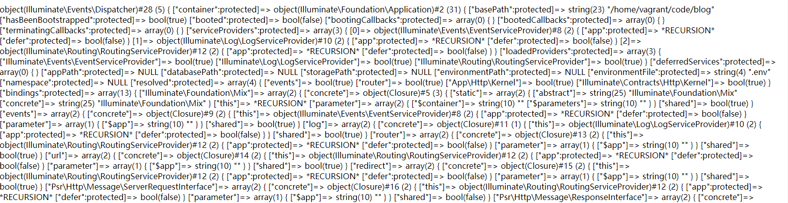
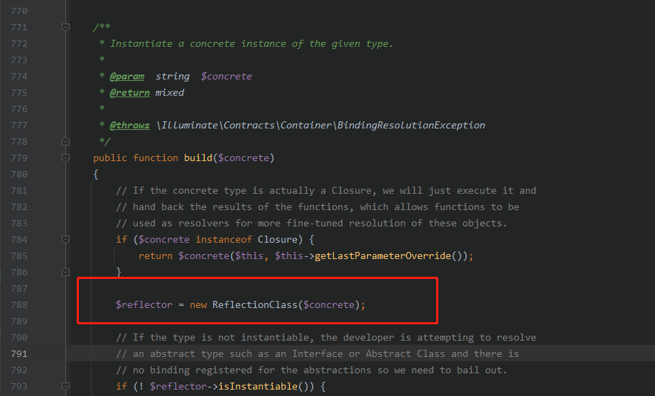
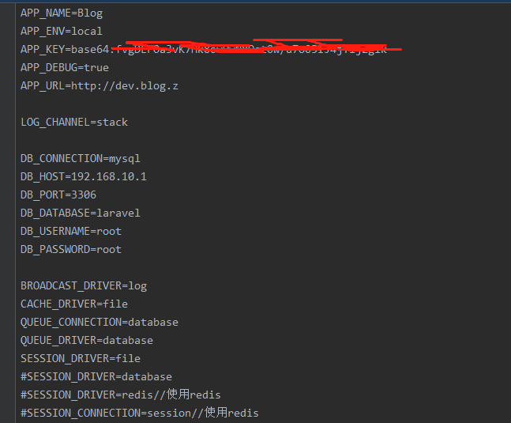

# 第八章：处理请求

现在我们重新回到第二章，目前我们来到了第四阶段：处理HTTP请求。对应的是下面这几行代码：

````php
$response = $kernel->handle(
    $request = Illuminate\Http\Request::capture()
);
````

我们先来看kernel这个对象的handle方法：

````php
/**
 * Handle an incoming HTTP request.
 *
 * @param  \Illuminate\Http\Request  $request
 * @return \Illuminate\Http\Response
 */
public function handle($request)
{
    try {
        $request->enableHttpMethodParameterOverride();

        $response = $this->sendRequestThroughRouter($request);
    } catch (Exception $e) {
        $this->reportException($e);

        $response = $this->renderException($request, $e);
    } catch (Throwable $e) {
        $this->reportException($e = new FatalThrowableError($e));

        $response = $this->renderException($request, $e);
    }

    $this->app['events']->dispatch(
        new Events\RequestHandled($request, $response)
    );

    return $response;
}
````

> vendor/laravel/framework/src/Illuminate/Foundation/Http/Kernel.php

这个方法内部的代码从整体来看，使用了下面的结构：

````php
try {

} catch() {

} catch () {

}
````

也就是try catch catch结构，和一般我们使用的try catch不同，这里连续使用了两个catch。并且第二个catch捕获的不是Exception，而是Throwable。这是因为Throwable包含了Exception和Error两种情况，当程序抛出的是Error时，是无法被Exception接住的，但是用Throwable肯定可以接住，Throwable是php7新增加的内容，读者可自行补充这部分知识，这里就不详细展开了。

接下来，我们来看try中的主体语句：

````php
$request->enableHttpMethodParameterOverride();
$response = $this->sendRequestThroughRouter($request);
````

`enableHttpMethodParameterOverride()`是`\Illuminate\Http\Request`类的父类`\Symfony\Component\HttpFoundation\Request`的方法：

````php
/**
 * Enables support for the _method request parameter to determine the intended HTTP method.
 *
 * Be warned that enabling this feature might lead to CSRF issues in your code.
 * Check that you are using CSRF tokens when required.
 * If the HTTP method parameter override is enabled, an html-form with method "POST" can be altered
 * and used to send a "PUT" or "DELETE" request via the _method request parameter.
 * If these methods are not protected against CSRF, this presents a possible vulnerability.
 *
 * The HTTP method can only be overridden when the real HTTP method is POST.
 */
public static function enableHttpMethodParameterOverride()
{
    self::$httpMethodParameterOverride = true;
}
````

> vendor/symfony/http-foundation/Request.php

这里，我们简单介绍一下httpMethodParameterOverride这个变量的作用：当设置$httpMethodParameterOverride参数值为true时，使用表单进行POST提交http请求时，可以通过设置表单_method参数值来向服务器发送PUT或者DELETE请求。即Laravel可以将POST请求转换为PUT或者DELETE请求，前提是必须设置$httpMethodParameterOverride参数值为true。

接下来继续看后面这行代码：

````php
$response = $this->sendRequestThroughRouter($request);
````

追踪sendRequestThroughRouter方法：

````php
/**
 * Send the given request through the middleware / router.
 *
 * @param  \Illuminate\Http\Request  $request
 * @return \Illuminate\Http\Response
 */
protected function sendRequestThroughRouter($request)
{
    $this->app->instance('request', $request);

    Facade::clearResolvedInstance('request');

    $this->bootstrap();

    return (new Pipeline($this->app))
        ->send($request)
        ->through($this->app->shouldSkipMiddleware() ? [] : $this->middleware)
        ->then($this->dispatchToRouter());
}
````

> vendor/laravel/framework/src/Illuminate/Foundation/Http/Kernel.php

到这里，框架在做了大量的前期准备工作之后，终于进入了正式的"启动"阶段。

首先框架调用自身的instance方法，做了一次键值对绑定，同时清除保存在$resolvedInstance数组中的request键值对。

接下来，执行了一个非常重要的方法bootstrap：

````php
/**
 * Bootstrap the application for HTTP requests.
 *
 * @return void
 */
public function bootstrap()
{
    if (! $this->app->hasBeenBootstrapped()) {
        $this->app->bootstrapWith($this->bootstrappers());
    }
}
````

> vendor/laravel/framework/src/Illuminate/Foundation/Http/Kernel.php

继续追踪bootstrapWith方法：

````php
/**
 * Run the given array of bootstrap classes.
 *
 * @param  string[]  $bootstrappers
 * @return void
 */
public function bootstrapWith(array $bootstrappers)
{
    $this->hasBeenBootstrapped = true;

    foreach ($bootstrappers as $bootstrapper) {
        $this['events']->dispatch('bootstrapping: '.$bootstrapper, [$this]);

        $this->make($bootstrapper)->bootstrap($this);

        $this['events']->dispatch('bootstrapped: '.$bootstrapper, [$this]);
    }
}
````

> vendor/laravel/framework/src/Illuminate/Foundation/Application.php

到这里，我们不得不去弄清楚$bootstrappers数组中包含了哪些内容，在文件vendor\laravel\framework\src\Illuminate\Foundation\Http\Kernel.php中，我们能看到这个变量的初始化代码：

````php
/**
 * The bootstrap classes for the application.
 *
 * @var array
 */
protected $bootstrappers = [
    \Illuminate\Foundation\Bootstrap\LoadEnvironmentVariables::class,
    \Illuminate\Foundation\Bootstrap\LoadConfiguration::class,
    \Illuminate\Foundation\Bootstrap\HandleExceptions::class,
    \Illuminate\Foundation\Bootstrap\RegisterFacades::class,
    \Illuminate\Foundation\Bootstrap\RegisterProviders::class,
    \Illuminate\Foundation\Bootstrap\BootProviders::class,
];
````

> vendor/laravel/framework/src/Illuminate/Foundation/Http/Kernel.php

结合上面的循环语句，我们来仔细分析一下bootstrapWith方法中究竟发生了什么：

首先我们要弄清楚$this['events']中是什么内容，一个比较简单的方法是回到bootstrapWith方法中直接进行var_dump中断测试：

````php
/**
 * Run the given array of bootstrap classes.
 *
 * @param  string[]  $bootstrappers
 * @return void
 */
public function bootstrapWith(array $bootstrappers)
{
    $this->hasBeenBootstrapped = true;
    var_dump($this['events']);exit;

    foreach ($bootstrappers as $bootstrapper) {
        $this['events']->dispatch('bootstrapping: '.$bootstrapper, [$this]);

        $this->make($bootstrapper)->bootstrap($this);

        $this['events']->dispatch('bootstrapped: '.$bootstrapper, [$this]);
    }
}
````

> vendor/laravel/framework/src/Illuminate/Foundation/Http/Kernel.php

结果如下：



【图8.1】

我们看到$this['events']实际上就是\Illmuinate\Events\Dispatcher类，那么框架是在哪一步将"events"这个键绑定上去的呢？

请读者回到第六章，在registerBaseServiceProviders这个方法中：

````php
/**
 * Register all of the base service providers.
 *
 * @return void
 */
protected function registerBaseServiceProviders()
{
    $this->register(new EventServiceProvider($this));
    $this->register(new LogServiceProvider($this));
    $this->register(new RoutingServiceProvider($this));
}    
````

> vendor/laravel/framework/src/Illuminate/Foundation/Application.php

我们讲解了一行代码：`$this->register(new EventServiceProvider($this));`，这个过程正好将"events"这个键绑定给了app容器。但是我们还得注意到，绑定的时候是调用的singleton方法。这种情况下，不应该是先通过app容器的成员变量bindings去访问才能获取到相应的值吗？

为了弄清楚事情的真相，我们还是得借助var_dump中断测试这个万能的方法。

首先，我们要确定events键值对是不是真的在`$this->register(new EventServiceProvider($this));`语句执行后才存在于app容器身上。怎么测试呢？很简单，在registerBaseServiceProviders方法中，注释`$this->register(new EventServiceProvider($this));`这一行。同时，在bootstrapWith方法中仍然打印$this['events']，并exit：


【图8.2】

运行结果说明，events键值对，确实是在执行完`$this->register(new EventServiceProvider($this));`语句后才存在于app容器身上。

我们定位到Container类的第788行，发现这里是Container类的build方法：



【图8.3】

而build方法通常都是由app容器的make方法调用之后触发调用的。难道$this['events']这种表达式能触发容器的make方法吗？

重新回到Container类自身，通过仔细查看Container类的源码，我们发现，这个类继承了ArrayAccess这个接口！如果读者对php中的SPL这部分内容足够熟悉的话，应该很快能意识到，答案就在于此。

当书写$this['events']这个表达式时，实际上是调用了Container类内部的offsetGet方法，这个方法正好引用了make方法：

```php
/**
 * Get the value at a given offset.
 *
 * @param  string  $key
 * @return mixed
 */
public function offsetGet($key)
{
    return $this->make($key);
}
```

> vendor/laravel/framework/src/Illuminate/Container/Container.php

现在我们再次回到bootstrapWith方法：

```php
/**
 * Run the given array of bootstrap classes.
 *
 * @param  string[]  $bootstrappers
 * @return void
 */
public function bootstrapWith(array $bootstrappers)
{
    $this->hasBeenBootstrapped = true;

    foreach ($bootstrappers as $bootstrapper) {
        $this['events']->dispatch('bootstrapping: '.$bootstrapper, [$this]);

        $this->make($bootstrapper)->bootstrap($this);

        $this['events']->dispatch('bootstrapped: '.$bootstrapper, [$this]);
    }
}
```

> vendor/laravel/framework/src/Illuminate/Foundation/Http/Kernel.php

foreach里面的语句，让人感觉很是疑惑：为什么第一次dispatch之后，又重新dispatch一次呢？

要了解这一点，需要我们去查看Application类的相关源码：

```php
/**
 * Register a callback to run before a bootstrapper.
 *
 * @param  string  $bootstrapper
 * @param  \Closure  $callback
 * @return void
 */
public function beforeBootstrapping($bootstrapper, Closure $callback)
{
	$this['events']->listen('bootstrapping: '.$bootstrapper, $callback);
}

/**
 * Register a callback to run after a bootstrapper.
 *
 * @param  string  $bootstrapper
 * @param  \Closure  $callback
 * @return void
 */
public function afterBootstrapping($bootstrapper, Closure $callback)
{
	$this['events']->listen('bootstrapped: '.$bootstrapper, $callback);
}
```

> vendor/laravel/framework/src/Illuminate/Foundation/Application.php

通过上面这两个方法的源码我们可以看到，通过调用`beforeBootstrapping`和`afterBootstrapping`这两个方法，可以给$bootstrapper这个关键字拼接一个启动中(bootstrapping: )和启动后(bootstrapped: )的固定字符串，将拼接到的字符串作为关键字存储到events对象的listeners数组中，数组的键就是这个关键字，值就是传递进来的$callback。

大家可以在Dispatcher类的`listen`方法中找到这部分实现：

```php
/**
 * Register an event listener with the dispatcher.
 *
 * @param  string|array  $events
 * @param  mixed  $listener
 * @return void
 */
public function listen($events, $listener)
{
	foreach ((array) $events as $event) {
		if (Str::contains($event, '*')) {
			$this->setupWildcardListen($event, $listener);
		} else {
			$this->listeners[$event][] = $this->makeListener($listener);
		}
	}
}
```

> vendor/laravel/framework/src/Illuminate/Events/Dispatcher.php

回到`bootstrapWith`中来，现在解答一下为什么循环体中核心语句`$this->make($bootstrapper)->bootstrap($this);`前后会各有一次`$this['events']->dispatch(...)`操作。

这里实际上就是Laravel框架给大家预留的触发事件的机制，即在程序启动过程中，某些类执行`bootstrap`前后，可以手动加入"启动前"和"启动后"事件。默认仅限于这些类：

```php
\Illuminate\Foundation\Bootstrap\LoadEnvironmentVariables::class,
\Illuminate\Foundation\Bootstrap\LoadConfiguration::class,
\Illuminate\Foundation\Bootstrap\HandleExceptions::class,
\Illuminate\Foundation\Bootstrap\RegisterFacades::class,
\Illuminate\Foundation\Bootstrap\RegisterProviders::class,
\Illuminate\Foundation\Bootstrap\BootProviders::class,
```

为什么说是默认仅限于上面这些类呢？这是因为`bootstrapWith`方法中接受的参数值是通过`$this->bootstrappers()`语句得到的，而通过追踪`bootstrappers`方法：

```php
/**
 * Get the bootstrap classes for the application.
 *
 * @return array
 */
protected function bootstrappers()
{
	return $this->bootstrappers;
}
```

> vendor/laravel/framework/src/Illuminate/Foundation/Http/Kernel.php

我们最终能看到框架自定义的成员变量$bootstrappers值：

```php
/**
 * The bootstrap classes for the application.
 *
 * @var array
 */
protected $bootstrappers = [
	\Illuminate\Foundation\Bootstrap\LoadEnvironmentVariables::class,
	\Illuminate\Foundation\Bootstrap\LoadConfiguration::class,
	\Illuminate\Foundation\Bootstrap\HandleExceptions::class,
	\Illuminate\Foundation\Bootstrap\RegisterFacades::class,
	\Illuminate\Foundation\Bootstrap\RegisterProviders::class,
	\Illuminate\Foundation\Bootstrap\BootProviders::class,
];
```

> vendor/laravel/framework/src/Illuminate/Foundation/Http/Kernel.php

接下来我们继续分析`dispatch`这个方法：

```php
/**
 * Fire an event and call the listeners.
 *
 * @param  string|object  $event
 * @param  mixed  $payload
 * @param  bool  $halt
 * @return array|null
 */
public function dispatch($event, $payload = [], $halt = false)
{
    // When the given "event" is actually an object we will assume it is an event
    // object and use the class as the event name and this event itself as the
    // payload to the handler, which makes object based events quite simple.
    [$event, $payload] = $this->parseEventAndPayload(
        $event, $payload
    );

    if ($this->shouldBroadcast($payload)) {
        $this->broadcastEvent($payload[0]);
    }

    $responses = [];

    foreach ($this->getListeners($event) as $listener) {
        $response = $listener($event, $payload);

        // If a response is returned from the listener and event halting is enabled
        // we will just return this response, and not call the rest of the event
        // listeners. Otherwise we will add the response on the response list.
        if ($halt && ! is_null($response)) {
            return $response;
        }

        // If a boolean false is returned from a listener, we will stop propagating
        // the event to any further listeners down in the chain, else we keep on
        // looping through the listeners and firing every one in our sequence.
        if ($response === false) {
            break;
        }

        $responses[] = $response;
    }

    return $halt ? null : $responses;
}
```

> vendor/laravel/framework/src/Illuminate/Events/Dispatcher.php

通过阅读这部分源码，我们大致可以看出来，dispatch方法实际上是在判断当前传入的类是否需要broadcast，需要则直接执行broadcastEvent的动作，并最终执行具体的listen动作并返回结果。

> 这里的代码实际上和"广播"和""事件"有密切的关系，关于dispatch方法的详细解析，请参考【附录七】

默认情况下，我们没有给框架添加任何事件，因此在bootstrapWith方法中注释这两个bootstrap，并不会影响首页的正常渲染。大家可以自行测试：

```php
/**
 * Run the given array of bootstrap classes.
 *
 * @param  string[]  $bootstrappers
 * @return void
 */
public function bootstrapWith(array $bootstrappers)
{
    $this->hasBeenBootstrapped = true;

    foreach ($bootstrappers as $bootstrapper) {
        //$this['events']->dispatch('bootstrapping: '.$bootstrapper, [$this]);

        $this->make($bootstrapper)->bootstrap($this);

        //$this['events']->dispatch('bootstrapped: '.$bootstrapper, [$this]);
    }
}
```

> vendor/laravel/framework/src/Illuminate/Foundation/Application.php

接下来，我们重点关注这一行语句：

```php
$this->make($bootstrapper)->bootstrap($this);
```

make方法无需做过多解释，接下来我们看看bootstrappers数组中的这些类，他们各自的bootstrap方法都做了什么：

我们先回到bootstrappers数组的初始化：

```php
protected $bootstrappers = [
    \Illuminate\Foundation\Bootstrap\LoadEnvironmentVariables::class,
    \Illuminate\Foundation\Bootstrap\LoadConfiguration::class,
    \Illuminate\Foundation\Bootstrap\HandleExceptions::class,
    \Illuminate\Foundation\Bootstrap\RegisterFacades::class,
    \Illuminate\Foundation\Bootstrap\RegisterProviders::class,
    \Illuminate\Foundation\Bootstrap\BootProviders::class,
];
```

> vendor/laravel/framework/src/Illuminate/Foundation/Http/Kernel.php

## LoadEnvironmentVariables
第一个类LoadEnvironmentVariables：

```php
/**
 * Bootstrap the given application.
 *
 * @param  \Illuminate\Contracts\Foundation\Application  $app
 * @return void
 */
public function bootstrap(Application $app)
{
    if ($app->configurationIsCached()) {
        return;
    }

    $this->checkForSpecificEnvironmentFile($app);

    try {
        $this->createDotenv($app)->safeLoad();
    } catch (InvalidFileException $e) {
        $this->writeErrorAndDie($e);
    }
}    
```

> vendor/laravel/framework/src/Illuminate/Foundation/Bootstrap/LoadEnvironmentVariables.php

这段代码中，核心的语句是try里面的：`$this->createDotenv($app)->safeLoad();`

这个地方的方法，涉及到Dotenv类的相关使用，在此我们不做过多赘述。大家可以简单理解为加载配置文件并解析为全局常量即可。

## LoadConfiguration
第二个类LoadConfiguration：

```php
/**
 * Bootstrap the given application.
 *
 * @param  \Illuminate\Contracts\Foundation\Application  $app
 * @return void
 */
public function bootstrap(Application $app)
{
    $items = [];

    // First we will see if we have a cache configuration file. If we do, we'll load
    // the configuration items from that file so that it is very quick. Otherwise
    // we will need to spin through every configuration file and load them all.
    if (file_exists($cached = $app->getCachedConfigPath())) {
        $items = require $cached;

        $loadedFromCache = true;
    }

    // Next we will spin through all of the configuration files in the configuration
    // directory and load each one into the repository. This will make all of the
    // options available to the developer for use in various parts of this app.
    $app->instance('config', $config = new Repository($items));

    if (! isset($loadedFromCache)) {
        $this->loadConfigurationFiles($app, $config);
    }

    // Finally, we will set the application's environment based on the configuration
    // values that were loaded. We will pass a callback which will be used to get
    // the environment in a web context where an "--env" switch is not present.
    $app->detectEnvironment(function () use ($config) {
        return $config->get('app.env', 'production');
    });

    date_default_timezone_set($config->get('app.timezone', 'UTC'));

    mb_internal_encoding('UTF-8');
}    
```

> vendor/laravel/framework/src/Illuminate/Foundation/Bootstrap/LoadConfiguration.php

这段代码仍然是在加载配置文件，可能读者会疑惑：上一步不是已经加载了配置文件吗，为什么还要再加载一次？

我们打开.env文件和config目录中一个具体的配置文件database.php，看看其中的内容：

.env配置文件源码部分截图：



【图8.4】

database.php文件源码部分：

```php
<?php

use Illuminate\Support\Str;

return [

    /*
    |--------------------------------------------------------------------------
    | Default Database Connection Name
    |--------------------------------------------------------------------------
    |
    | Here you may specify which of the database connections below you wish
    | to use as your default connection for all database work. Of course
    | you may use many connections at once using the Database library.
    |
    */

    'default' => env('DB_CONNECTION', 'mysql'),

    /*
    |--------------------------------------------------------------------------
    | Database Connections
    |--------------------------------------------------------------------------
    |
    | Here are each of the database connections setup for your application.
    | Of course, examples of configuring each database platform that is
    | supported by Laravel is shown below to make development simple.
    |
    |
    | All database work in Laravel is done through the PHP PDO facilities
    | so make sure you have the driver for your particular database of
    | choice installed on your machine before you begin development.
    |
    */

    'connections' => [

        'sqlite' => [
            'driver' => 'sqlite',
            'url' => env('DATABASE_URL'),
            'database' => env('DB_DATABASE', database_path('database.sqlite')),
            'prefix' => '',
            'foreign_key_constraints' => env('DB_FOREIGN_KEYS', true),
        ],

        'mysql' => [
            'driver' => 'mysql',
            'url' => env('DATABASE_URL'),
            'host' => env('DB_HOST', '127.0.0.1'),
            'port' => env('DB_PORT', '3306'),
            'database' => env('DB_DATABASE', 'laravel'),
            'username' => env('DB_USERNAME', 'forge'),
            'password' => env('DB_PASSWORD', ''),
            'unix_socket' => env('DB_SOCKET', ''),
            'charset' => 'utf8mb4',
            'collation' => 'utf8mb4_unicode_ci',
            'prefix' => '',
            'prefix_indexes' => true,
            'strict' => true,
            'engine' => null,
            'options' => extension_loaded('pdo_mysql') ? array_filter([
                PDO::MYSQL_ATTR_SSL_CA => env('MYSQL_ATTR_SSL_CA'),
            ]) : [],
        ],
        ... ...
```

> config/database.php

我们看到，.env配置文件是简单的一行一个配置，而data.php文件中，是典型的数组结构，并且data.php中很多地方使用到的env()函数，实际就是在引用.env配置文件中的值。这样大家就应该清楚了，框架在实际应用场景中，很多情况下并不是直接和.env配置文件打交道，而是和config文件夹下的某个具体的配置文件打交道。因此config配置文件中的数组，都是按键值对的形式整理的。

因此两次对配置文件的处理，都是必要的，并不是多此一举。

## HandleExceptions
第三个类HandleExceptions：

```php
/**
 * Bootstrap the given application.
 *
 * @param  \Illuminate\Contracts\Foundation\Application  $app
 * @return void
 */
public function bootstrap(Application $app)
{
    self::$reservedMemory = str_repeat('x', 10240);

    $this->app = $app;

    error_reporting(-1);

    set_error_handler([$this, 'handleError']);

    set_exception_handler([$this, 'handleException']);

    register_shutdown_function([$this, 'handleShutdown']);

    if (! $app->environment('testing')) {
        ini_set('display_errors', 'Off');
    }
}
```

> vendor/laravel/framework/src/Illuminate/Foundation/Bootstrap/HandleExceptions.php

这个方法中的代码浅显易懂，就是简单做一些错误及异常处理方面的工作。

## RegisterFacades
第四个类RegisterFacades：

```php
/**
 * Bootstrap the given application.
 *
 * @param  \Illuminate\Contracts\Foundation\Application  $app
 * @return void
 */
public function bootstrap(Application $app)
{
    Facade::clearResolvedInstances();

    Facade::setFacadeApplication($app);

    AliasLoader::getInstance(array_merge(
        $app->make('config')->get('app.aliases', []),
        $app->make(PackageManifest::class)->aliases()
    ))->register();
}    
```

> vendor/laravel/framework/src/Illuminate/Foundation/Bootstrap/RegisterFacades.php

这部分代码是处理Facade门面类和Alias别名类的，Laravel框架使用了门面模式和别名类来简化类的使用。

## RegisterProviders
第五个类RegisterProviders：

```php
/**
 * Bootstrap the given application.
 *
 * @param  \Illuminate\Contracts\Foundation\Application  $app
 * @return void
 */
public function bootstrap(Application $app)
{
    $app->registerConfiguredProviders();
}
```

> vendor/laravel/framework/src/Illuminate/Foundation/Bootstrap/RegisterProviders.php

这个部分的代码，是处理Providers目录中的所有ServiceProvider类的。

> RegisterFacades和RegisterProviders这两个类中的bootstrap方法，和Laravel中的"扩展自动注册"密切相关，这部分内容请参考【附录八】

## BootProviders
第六个类BootProviders：

```php
/**
 * Bootstrap the given application.
 *
 * @param  \Illuminate\Contracts\Foundation\Application  $app
 * @return void
 */
public function bootstrap(Application $app)
{
    $app->boot();
}
```

> vendor/laravel/framework/src/Illuminate/Foundation/Bootstrap/BootProviders.php

继续追踪boot方法：

```php
/**
 * Boot the application's service providers.
 *
 * @return void
 */
public function boot()
{
    if ($this->isBooted()) {
        return;
    }

    // Once the application has booted we will also fire some "booted" callbacks
    // for any listeners that need to do work after this initial booting gets
    // finished. This is useful when ordering the boot-up processes we run.
    $this->fireAppCallbacks($this->bootingCallbacks);

    array_walk($this->serviceProviders, function ($p) {
        $this->bootProvider($p);
    });

    $this->booted = true;

    $this->fireAppCallbacks($this->bootedCallbacks);
}
```

> vendor/laravel/framework/src/Illuminate/Foundation/Application.php

我们看到，这部分主要是处理app的两个回调数组(一个是"启动中回调数组"保存的事件，一个是"启动后回调数组“保存的事件)，还会调用各个ServiceProvider类的bootProvider方法，并且将容器app的成员变量booted设置为true(标记app已经启动)。

现在请大家回到这一章的开头，我们终于分析完了sendRequestThroughRouter方法中的下面这一行语句：

```php
$this->bootstrap();
```

接下来，我们继续分析sendRequestThroughRouter方法中剩下的最重要的另一条语句：

```php
return (new Pipeline($this->app))
                    ->send($request)
                    ->through($this->app->shouldSkipMiddleware() ? [] : $this->middleware)
                    ->then($this->dispatchToRouter());
```

这条语句，可以简单理解为：借助app容器使用管道类处理HTTP请求，并将结果返回。

为什么要命名为管道类呢？因为Laravel的logo像极了一个互相串连的管道啊！

接下来我们开始分析这条语句是如何完成核心的路由解析的。

我们先来看一下Pipeline这个类的构造函数：

```php
/**
 * Create a new class instance.
 *
 * @param  \Illuminate\Contracts\Container\Container|null  $container
 * @return void
 */
public function __construct(Container $container = null)
{
    $this->container = $container;
}
```

> vendor/laravel/framework/src/Illuminate/Pipeline/Pipeline.php

很简单，这里只是将容器app挂载到自身的保护成员container上。

> 注意：Pipeline本身没有构造函数时，向其继承的父类查找

接着看send方法：

```php
/**
 * Set the object being sent through the pipeline.
 *
 * @param  mixed  $passable
 * @return $this
 */
public function send($passable)
{
    $this->passable = $passable;

    return $this;
}
```

> vendor/laravel/framework/src/Illuminate/Pipeline/Pipeline.php

这个方法，只是简单地给自身保护成员passable赋值。结合实际的情况看，这里就是将获取到的request对象赋值给passable。

继续看through方法：

```php
/**
 * Set the array of pipes.
 *
 * @param  array|mixed  $pipes
 * @return $this
 */
public function through($pipes)
{
    $this->pipes = is_array($pipes) ? $pipes : func_get_args();

    return $this;
}
```

> vendor/laravel/framework/src/Illuminate/Pipeline/Pipeline.php

这个方法也容易理解，给对象的成员变量pipes赋值，继续追踪传递进来的的参数，我们需要回到app容器的shouldSkipMiddleware方法：

```php
/**
 * Determine if middleware has been disabled for the application.
 *
 * @return bool
 */
public function shouldSkipMiddleware()
{
    return $this->bound('middleware.disable') &&
        $this->make('middleware.disable') === true;
}
```

> vendor/laravel/framework/src/Illuminate/Foundation/Application.php

结合through这条语句：

```php
->through($this->app->shouldSkipMiddleware() ? [] : $this->middleware)
```

可以看到，through这个步骤，只是把中间件数组装填到pipes成员变量中。但是查看middleware可以知道，这个成员变量初始化时值是个空数组，那中间件middleware又是在什么时候才有值的呢？

> Kernel类中包含下面这条语句：`protected $middleware = [];`

这里我们需要再次回到Kernel类的调用过程，去看看发生了什么。我们知道，框架是使用了make方法，通过反射的方式反向构建出了Kernel类的实例，对应下面这条语句：

```php
$kernel = $app->make(Illuminate\Contracts\Http\Kernel::class);
```

请大家注意，make方法虽然传入的参数值是`Illuminate\Contracts\Http\Kernel::class`，但是实际这里构建出的类是`\Illuminate\Foundation\Http\Kernel`，于是我们追踪这个类的构造函数：

```php
/**
 * Create a new HTTP kernel instance.
 *
 * @param  \Illuminate\Contracts\Foundation\Application  $app
 * @param  \Illuminate\Routing\Router  $router
 * @return void
 */
public function __construct(Application $app, Router $router)
{
    $this->app = $app;
    $this->router = $router;

    $router->middlewarePriority = $this->middlewarePriority;

    foreach ($this->middlewareGroups as $key => $middleware) {
        $router->middlewareGroup($key, $middleware);
    }

    foreach ($this->routeMiddleware as $key => $middleware) {
        $router->aliasMiddleware($key, $middleware);
    }
}
```

> vendor/laravel/framework/src/Illuminate/Foundation/Http/Kernel.php

通过阅读这里的源码，大家应该能很清楚得看到，这个部分确实是有做middleware的处理。

接下来，我们看Piple类的最后一个方法then：

```php
/**
 * Run the pipeline with a final destination callback.
 *
 * @param  \Closure  $destination
 * @return mixed
 */
public function then(Closure $destination)
{
    $pipeline = array_reduce(
        array_reverse($this->pipes), $this->carry(), $this->prepareDestination($destination)
    );

    return $pipeline($this->passable);
}
```

> vendor/laravel/framework/src/Illuminate/Pipeline/Pipeline.php

我们知道$this->passable实际上就是request对象，then里面传入的参数是下面这条语句得到的：

```php
$this->dispatchToRouter()
```

继续追踪dispatchToRouter方法：

```php
/**
 * Get the route dispatcher callback.
 *
 * @return \Closure
 */
protected function dispatchToRouter()
{
    return function ($request) {
        $this->app->instance('request', $request);

        return $this->router->dispatch($request);
    };
}
```

> vendor/laravel/framework/src/Illuminate/Foundation/Http/Kernel.php

这里，调用了Router类的dispatch方法：

```php
/**
 * Dispatch the request to the application.
 *
 * @param  \Illuminate\Http\Request  $request
 * @return \Illuminate\Http\Response|\Illuminate\Http\JsonResponse
 */
public function dispatch(Request $request)
{
    $this->currentRequest = $request;

    return $this->dispatchToRoute($request);
}
```

> vendor/laravel/framework/src/Illuminate/Routing/Router.php

现在我们重点来看一下dispatchToRoute方法：

```php
/**
 * Dispatch the request to a route and return the response.
 *
 * @param  \Illuminate\Http\Request  $request
 * @return \Illuminate\Http\Response|\Illuminate\Http\JsonResponse
 */
public function dispatchToRoute(Request $request)
{
	return $this->runRoute($request, $this->findRoute($request));
}
```

> vendor/laravel/framework/src/Illuminate/Routing/Router.php

继续追踪runRoute和findRoute：

findRoute:

```php
/** 
 * Find the route matching a given request.
 *
 * @param  \Illuminate\Http\Request  $request
 * @return \Illuminate\Routing\Route
 */
protected function findRoute($request)
{
	$this->current = $route = $this->routes->match($request);

	$this->container->instance(Route::class, $route);

	return $route;
}
```

> vendor/laravel/framework/src/Illuminate/Routing/Router.php

这里，我们不对findRoute中的代码做过多的讲解（详细分析请参考【附录九】），只是简单告诉大家，findRoute方法就是根据当前传入的request对象，查找出匹配的路由。这里大家应该能想象出来，查找到的这个route对象身上，肯定会包含controller和method信息。

runRoute：

```php
/**
 * Return the response for the given route.
 *
 * @param  \Illuminate\Http\Request  $request
 * @param  \Illuminate\Routing\Route  $route
 * @return \Illuminate\Http\Response|\Illuminate\Http\JsonResponse
 */
protected function runRoute(Request $request, Route $route)
{
    $request->setRouteResolver(function () use ($route) {
        return $route;
    });

    $this->events->dispatch(new Events\RouteMatched($route, $request));

    return $this->prepareResponse($request,
        $this->runRouteWithinStack($route, $request)
    );
}
```

> vendor/laravel/framework/src/Illuminate/Routing/Router.php

前面我们已经讲过，$this->events实际上就是Dispatcher类，这里我们可以暂时忽略dispatch方法中发生的事情，为什么呢？因为通过在dispatch方法中做var_dump中断测试，我们能看到dispatch中并没有任何广播和订阅事件发生：

```php
 /**
  * Fire an event and call the listeners.
  *
  * @param  string|object  $event
  * @param  mixed  $payload
  * @param  bool  $halt
  * @return array|null
  */
public function dispatch($event, $payload = [], $halt = false)
{
	// When the given "event" is actually an object we will assume it is an event
	// object and use the class as the event name and this event itself as the
	// payload to the handler, which makes object based events quite simple.
	[$event, $payload] = $this->parseEventAndPayload(
		$event, $payload
	);

	if ($this->shouldBroadcast($payload)) {
		$this->broadcastEvent($payload[0]);
	}

	$responses = [];

	if ($event == \Illuminate\Routing\Events\RouteMatched::class) {
		$s = $this->getListeners($event);
		var_dump($s);
		var_dump($this->shouldBroadcast($payload));
		exit;
	}
	... ...

}
```

> vendor/laravel/framework/src/Illuminate/Events/Dispatcher.php

请大家注意上面这段代码中这几行语句：

```php
if ($event == \Illuminate\Routing\Events\RouteMatched::class) {
	$s = $this->getListeners($event);
	var_dump($s);
	var_dump($this->shouldBroadcast($payload));
	exit;
}
```

结果：

```php
array(0) { } bool(false)
```

通过这个var_dump中断测试的结果，结合dispatch方法中的实际代码，就能清楚：在我们没有对当前应用做任何改动的情况下，访问主页的这个URL时，runRoute方法中的dispatch确实"什么都没做"。

实际上，大家可以直接将runRoute方法中的这行语句：`$this->events->dispatch(new Events\RouteMatched($route, $request));`注释掉，重新刷新页面，会发现主页确实还是能正常访问。

继续看runRoute方法中的最后一条语句：

```php
return $this->prepareResponse($request,
	$this->runRouteWithinStack($route, $request)
);
```

先看prepareResponse方法：

```php
/**
 * Create a response instance from the given value.
 *
 * @param  \Symfony\Component\HttpFoundation\Request  $request
 * @param  mixed  $response
 * @return \Illuminate\Http\Response|\Illuminate\Http\JsonResponse
 */
public function prepareResponse($request, $response)
{
	return static::toResponse($request, $response);
}
```

>vendor/laravel/framework/src/Illuminate/Routing/Router.php

这个方法，就是返回一个Response对象。大家可以继续追踪toResponse方法，能看到这里的Response对象可能是不同类型的。这里我们可以理解为：一个URL请求被Laravel框架解析之后，返回的内容可能是html页面，也可能是json字符串，因此Response对象是不同类型的。

接下来看最后一个方法：runRouteWithinStack：

```php
/**
 * Run the given route within a Stack "onion" instance.
 *
 * @param  \Illuminate\Routing\Route  $route
 * @param  \Illuminate\Http\Request  $request
 * @return mixed
 */
protected function runRouteWithinStack(Route $route, Request $request)
{
	$shouldSkipMiddleware = $this->container->bound('middleware.disable') &&
			$this->container->make('middleware.disable') === true;

	$middleware = $shouldSkipMiddleware ? [] : $this->gatherRouteMiddleware($route);

	return (new Pipeline($this->container))
		->send($request)
		->through($middleware)
		->then(function ($request) use ($route) {
		    return $this->prepareResponse(
			$request, $route->run()
		    );
		});
}
```

> vendor/laravel/framework/src/Illuminate/Routing/Router.php

初读这段代码，我们会感觉到困惑：Pipeline明明已经运行过一次send、through和then，为什么在这个方法中又重新运行了一遍呢？实际上我们目前分析的这个runRouteWithinStack方法正是从之前的Pipeline对象的最后一步then方法中的`$this->dispatchToRouter()`语句追踪到的。

这里要怎么理解呢？Laravel的作者已经给出了提示：Run the given route within a Stack "onion" instance。在一个"洋葱"栈实例上运行给定的路由。我们发现，Pipeline由于实例化时传递的是同一个对象(app容器)，因此两次执行Pipeline类的send、through和then的动作，像极了剥洋葱的过程，剥开一层之后会看到里面又是新的一层。

可能读者还是会感到疑惑，这么做有什么特殊意义吗，一次就能处理完的步骤，非得处理成这样？

这里，我们可以简单分析一下作者这么做的原因。通过两次Pipeline上运行语句的区别，很容易看出，第二次的middleware已经和第一次传递的middleware不同。第二次的middleware实际是指向当前路由的专属middleware。其次，第二次then里面才是真正运行路由类的run方法，这个方法才是最终完成路由解析的核心语句，也就是说管道并不是直接处理路由的类，Route类才是。

我们继续看路由类上的run方法：

```php
/**
 * Run the route action and return the response.
 *
 * @return mixed
 */
public function run()
{
	$this->container = $this->container ?: new Container;

	try {
	    if ($this->isControllerAction()) {
			return $this->runController();
	    }

	    return $this->runCallable();
	} catch (HttpResponseException $e) {
	    return $e->getResponse();
	}
}
```

> vendor/laravel/framework/src/Illuminate/Routing/Route.php

我们直接在try语句块中做中断测试：

```php
if ($this->isControllerAction()) {
	exit('ccc');
	return $this->runController();
}

exit('ddd');
return $this->runCallable();
```

页面输出了ddd，因此这里执行的是`$this->runCallable()`语句。

继续追踪runCallable方法：

```php
/**
 * Run the route action and return the response.
 *
 * @return mixed
 */
protected function runCallable()
{
	$callable = $this->action['uses'];

	return $callable(...array_values($this->resolveMethodDependencies(
		$this->parametersWithoutNulls(), new ReflectionFunction($this->action['uses'])
	)));
}
```

> vendor/laravel/framework/src/Illuminate/Routing/Route.php

这里通过对$callable这个变量做var_dump中断测试，能看到`$this->action['uses']`中保存的实际上是一个闭包。因此这个方法的语句简单解释，就是直接取执行绑定在action成员数组中的uses这个键上的闭包函数，详细分析请参考【附录十】。

本章完。