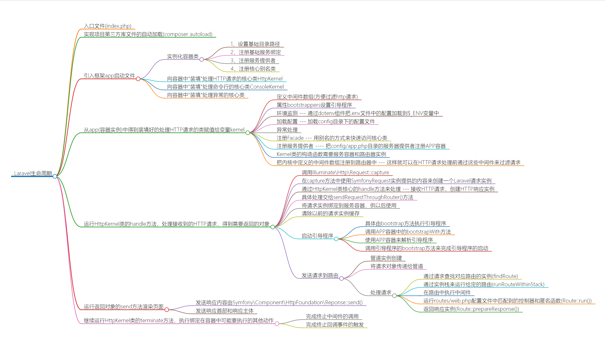

# 穿透Laravel

## 引言
近几年来Laravel在PHP领域大放异彩，逐渐成为PHP开发框架中的中流砥柱。
这个系列的文章, 会带你一起探知Laravel框架底层的实现细节。与其他框架相比，Laravel的设计理念确实更为先进(服务、容器、依赖注入、facade。。。)，初读代码时会感觉代码晦涩难懂，而一旦弄清了整套框架的基础结构，你就会惊叹于作者精巧的构思和对面向对象编程娴熟的驾驭能力。

下面是【穿透Laravel】这个系列文章对应的思维导图：

【图0.1】

以下为全书目录结构：

### 引言
### 第一章：基础环境搭建
#### 关于Nginx重定向
#### 思考
### 第二章：核心代码结构分析
### 第三章：实现自动加载
### 第四章：艰难的开始
#### new static
#### make方法
### 第五章：陷入困境
#### 闭包
#### 反射
#### 题外话
### 第六章：继续前行
### 第七章：解析HTTP内核
### 第八章：处理请求
### 第九章：渲染页面
### 第十章：终止程序
### 结束语
### 附录一：断点测试和中断测试
### 附录二：Container之instance方法
### 附录三：Container之resolve方法
### 附录四：Container之bind方法
### 附录五：Container之resolveDependencies方法
### 附录六：Application之register方法
### 附录七：Dispatcher之dispatcher方法
### 附录八：扩展自动注册(Package auto discovery)
### 附录九：Route之findRoute方法
### 附录十：Route之run方法
### 附录十一：ServiceProvider类的注册和引导