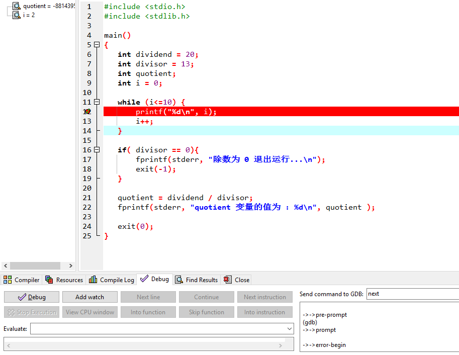
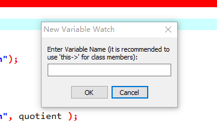
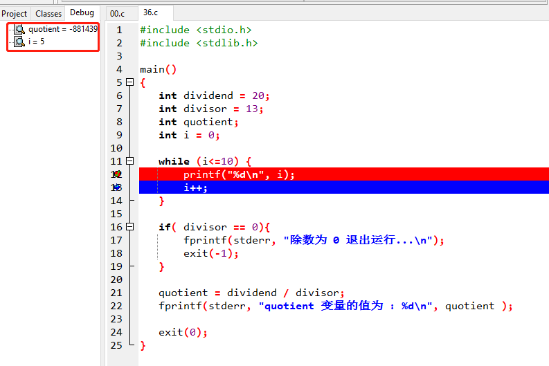

# 附录一：断点测试和中断测试

## 断点测试

断点这个概念来源于单步调试，在一次单步调试中，如果设置了一个断点，那么程序在debug的过程中会首先在断点处停下来。什么意思呢，就是说程序会先执行完断点之前的所有代码，在碰到断点所在行时，等待用户执行单步调试。单步调试时，可以跟踪代码中各个变量的值。

接下来，我们以Dev-C++为例(笔者本机上版本为5.6.3)，给大家详细演示一下一次单步调试的详细步骤。

首先我们编辑一个test.c文件，源码如下：

```c
#include <stdio.h>
#include <stdlib.h>
 
main()
{
   int dividend = 20;
   int divisor = 13;
   int quotient;
   int i = 0;
   
   while (i<=10) {
       printf("%d\n", i);
       i++;
   } 
 
   if( divisor == 0){
       fprintf(stderr, "除数为 0 退出运行...\n");
       exit(-1);
   }
   
   quotient = dividend / divisor;
   fprintf(stderr, "quotient 变量的值为 : %d\n", quotient );
 
   exit(0);
}
```

接下来，在编辑器中，将鼠标定位到下面这一行：

```c
printf("%d\n", i);
```

按F4键，或者鼠标移到这一行的行号位置(行号是编辑器自动标注出来的)点击鼠标，断点即设置成功。此时，该行会呈现为红色背景，且行首会出现一个红色的勾，如下：



【图11.1】

接下来，我们点击下面的"Add watch"按钮弹出如下对话框：



【图11.2】

这个对话框，是让我们输入需要监测的变量，在这个代码实例中，我们输入i即可。

接下来，就可以开始Debug了，单击底部的"Debug"按钮，代码在断点所在行停了下来并且背景色变成了蓝色。同时还弹出了一个命令行的结果窗口。笔者建议您使用一个外接显示器来调试代码，否则在单步调试时，你无法"实时"查看到结果窗中的变化。

当你给电脑连接上一个外接显示器后，你就可以直接将结果窗拖动到外接显示器上。之后我们点击底部的"Next line"按钮，就开启单步调试代码之旅了。每点击一次按钮，程序就多运行一步(这里的一步对应代码编辑器中的一行)，同时你能清楚地看到代码在循环、分支和顺序结构中的执行次序。并且，在设置了监测变量之后，编辑器左侧的Debug窗口中还会实时显示出变量在每一步代码运行后的值：



【图11.3】


在PHP中，同样有类似的断点测试工具，但是需要我们先安装php的xdebug扩展，这个过程稍显复杂。

## var_dump中断测试

通常php不会被用来书写包含复杂算法的大块代码，更多的是处理业务逻辑。因此大部分情况下，我们不需要安装xdebug扩展来做单步调试。使用var_dump输出函数，就可以有效完成代码的调试。

当然使用var_dump函数输出变量内容的同时，必须及时让代码停下来，否则我们可能需要等待程序运行很长时间才能看到输出的内容，而这是完全不必要的。一般我们在var_dump之后，紧跟着使用die或者exit函数就可以了。

> 注意：这里我们不提倡使用print_r函数，因为print_r输出信息时，不会包含变量的类型信息。比如一个整型的1和一个字符串的1，使用print_r输出时，命令行窗口都是显示1，这在很多情况下是不符合我们的调试需求的。