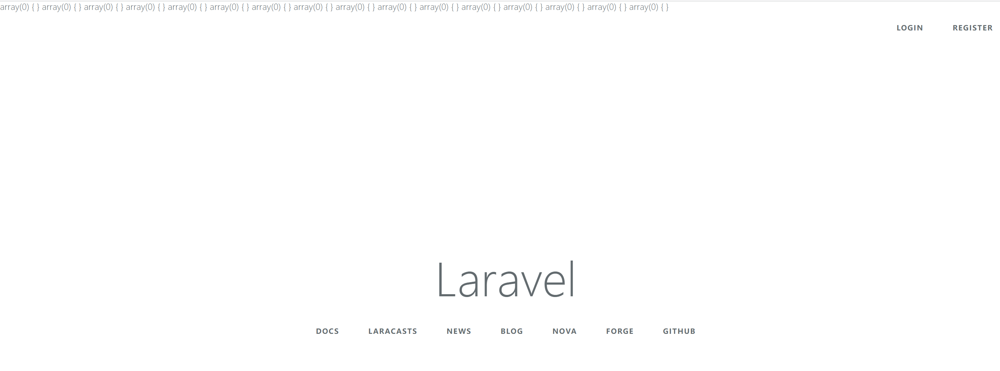

#  附录七：Dispatcher之dispatch方法

源文件路径：vendor\laravel\framework\src\Illuminate\Events\Dispatcher.php

方法名：dispatch

```php
public function dispatch($event, $payload = [], $halt = false)
{
	// When the given "event" is actually an object we will assume it is an event
	// object and use the class as the event name and this event itself as the
	// payload to the handler, which makes object based events quite simple.
	[$event, $payload] = $this->parseEventAndPayload(
		$event, $payload
	);

	if ($this->shouldBroadcast($payload)) {
		$this->broadcastEvent($payload[0]);
	}

	$responses = [];

	foreach ($this->getListeners($event) as $listener) {
		$response = $listener($event, $payload);

		// If a response is returned from the listener and event halting is enabled
		// we will just return this response, and not call the rest of the event
		// listeners. Otherwise we will add the response on the response list.
		if ($halt && ! is_null($response)) {
			return $response;
		}

		// If a boolean false is returned from a listener, we will stop propagating
		// the event to any further listeners down in the chain, else we keep on
		// looping through the listeners and firing every one in our sequence.
		if ($response === false) {
			break;
		}

		$responses[] = $response;
	}

	return $halt ? null : $responses;
}
```

首先我们看一下调用`dispatch`方法时，传入该方法的两个参数值是什么。为此我们需要追溯到Application类中的`bootstrapWith`方法(vendor\laravel\framework\src\Illuminate\Foundation\Application.php)：

```php
public function bootstrapWith(array $bootstrappers)
{
	$this->hasBeenBootstrapped = true;

	foreach ($bootstrappers as $bootstrapper) {
		$this['events']->dispatch('bootstrapping: '.$bootstrapper, [$this]);

		$this->make($bootstrapper)->bootstrap($this);

		$this['events']->dispatch('bootstrapped: '.$bootstrapper, [$this]);
	}
}
```

继续往前追溯bootstrapWith方法，我们需要知道这个数组中的内容：

```php
/**
 * Bootstrap the application for HTTP requests.
 *
 * @return void
 */
public function bootstrap()
{
	if (! $this->app->hasBeenBootstrapped()) {
		$this->app->bootstrapWith($this->bootstrappers());
	}
}
```

这个方法来源于Kernel类(vendor\laravel\framework\src\Illuminate\Foundation\Http\Kernel.php)，它是框架在启动过程中执行的一个重要方法。

从这里，我们能很清楚地看到传入`bootstrapWith`方法的参数值是`$this->bootstrappers()`，继续追踪`bootstrappers`方法：

```php
/**
 * Get the bootstrap classes for the application.
 *
 * @return array
 */
protected function bootstrappers()
{
	return $this->bootstrappers;
}
```

我们直接查看类的成员变量bootstrappers：

```php
/**
 * The bootstrap classes for the application.
 *
 * @var array
 */
protected $bootstrappers = [
	\Illuminate\Foundation\Bootstrap\LoadEnvironmentVariables::class,
	\Illuminate\Foundation\Bootstrap\LoadConfiguration::class,
	\Illuminate\Foundation\Bootstrap\HandleExceptions::class,
	\Illuminate\Foundation\Bootstrap\RegisterFacades::class,
	\Illuminate\Foundation\Bootstrap\RegisterProviders::class,
	\Illuminate\Foundation\Bootstrap\BootProviders::class,
];
```

这样，我们就明白了，传入`parseEventAndPayload`方法中的两个参数是这样的：

- $event参数是一个字符串，具体内容是$bootstrappers数组中的元素值和"bootstrapping:  "或者"bootstrapped:  "拼接得到的(注意这里$boostrappers数组中元素值是往后拼接)
- $payload参数是一个数组，数组中的内容就是容器对象本身

接下来，我们继续看`parseEventAndPayload`方法的源码：

```php
/**
 * Parse the given event and payload and prepare them for dispatching.
 *
 * @param  mixed  $event
 * @param  mixed  $payload
 * @return array
 */
protected function parseEventAndPayload($event, $payload)
{
	if (is_object($event)) {
		[$payload, $event] = [[$event], get_class($event)];
	}

	return [$event, Arr::wrap($payload)];
}
```

注意这里，默认情况下if中的语句并不会运行，原因是传入parseEventPayload中的参数是下面这两种形式：

a) bootstrapping: \Illuminate\Foundation\Bootstrap\LoadEnvironmentVariables

b) bootstrapped: \Illuminate\Foundation\Bootstrap\LoadEnvironmentVariables

显然这两个字符串对应的类并不存在。经过`parseEventAndPayload`处理后，$event和$payload对应的值分别是一个字符串和一个数组。大家可以在`dispatch`方法中做中断测试：

```php
public function dispatch($event, $payload = [], $halt = false)
{
	// When the given "event" is actually an object we will assume it is an event
	// object and use the class as the event name and this event itself as the
	// payload to the handler, which makes object based events quite simple.
	[$event, $payload] = $this->parseEventAndPayload(
	    $event, $payload
	);

	var_dump($event);
	var_dump($payload);
	exit;
    ...
    ... ...
```

结果如下：

```php
string(71) "bootstrapping: Illuminate\Foundation\Bootstrap\LoadEnvironmentVariables" array(1) { [0]=> object(Illuminate\Foundation\Application)#2 (31) { ["basePath":protected]=> string(23) "/home/vagrant/code/blog" ["hasBeenBootstrapped":protected]=> bool(true) ["booted":protected]=> bool(false) ["bootingCallbacks":protected]=> array(0) { } ["bootedCallbacks":protected]=> array(0) { } ["terminatingCallbacks":protected]=> array(0) { } ["serviceProviders":protected]=> array(3) { [0]=> object(Illuminate\Events\EventServiceProvider)#8 (2) { ["app":protected]=> *RECURSION* ["defer":protected]=> bool(false) } [1]=> object(Illuminate\Log\LogServiceProvider)#10 (2) { ["app":protected]=> *RECURSION* ["defer":protected]=> bool(false) } [2]=> object(Illuminate\Routing\RoutingServiceProvider)#12 (2) { ["app":protected]=> *RECURSION* ["defer":protected]=> bool(false) } } ["loadedProviders":protected]=> array(3) { ["Illuminate\Events\EventServiceProvider"]=> bool(true) ["Illuminate\Log\LogServiceProvider"]=> bool(true) ["Illuminate\Routing\RoutingServiceProvider"]=> bool(true) } ["deferredServices":protected]=> array(0) { } ["appPath":protected]=> NULL ["databasePath":protected]=> NULL ["storagePath":protected]=> NULL ["environmentPath":protected]=> NULL ["environmentFile":protected]=> string(4) ".env" ["namespace":protected]=> NULL ["resolved":protected]=> array(4) { ["events"]=> bool(true) ["router"]=> bool(true) ["App\Http\Kernel"]=> bool(true) ["Illuminate\Contracts\Http\Kernel"]=> bool(true) } ["bindings":protected]=> array(13) { ["Illuminate\Foundation\Mix"]=> array(2) { ["concrete"]=> object(Closure)#5 (3) { ["static"]=> array(2) { ["abstract"]=> string(25) "Illuminate\Foundation\Mix" ["concrete"]=> string(25) "Illuminate\Foundation\Mix" } ["this"]=> *RECURSION* ["parameter"]=> array(2) { ["$container"]=> string(10) "" ["$parameters"]=> string(10) "" } } ["shared"]=> bool(true) } ["events"]=> array(2) { ["concrete"]=> object(Closure)#9 (2) { ["this"]=> object(Illuminate\Events\EventServiceProvider)#8 (2) { ["app":protected]=> *RECURSION* ["defer":protected]=> bool(false) } ["parameter"]=> array(1) { ["$app"]=> string(10) "" } } ["shared"]=> bool(true) } ["log"]=> array(2) { ["concrete"]=> object(Closure)#11 (1) { ["this"]=> object(Illuminate\Log\LogServiceProvider)#10 (2) { ["app":protected]=> *RECURSION* ["defer":protected]=> bool(false) } } ["shared"]=> bool(true) } ["router"]=> array(2) { ["concrete"]=> object(Closure)#13 (2) { ["this"]=>...
```

接下来我们继续看后面的代码：

```php
if ($this->shouldBroadcast($payload)) {
	$this->broadcastEvent($payload[0]);
}
```

这里，先判断$payload是否需要broadcast, 需要则调用`broadcastEvent`方法：

shouldBroadcast方法：

```php
protected function shouldBroadcast(array $payload)
{
	return isset($payload[0]) &&
		$payload[0] instanceof ShouldBroadcast &&
		$this->broadcastWhen($payload[0]);
}
```

默认情况下，我们的容器对象并不是ShouldBroadcast类，我们可以手动在`dispatch`方法中做中断测试：

```php
public function dispatch($event, $payload = [], $halt = false)
{
	// When the given "event" is actually an object we will assume it is an event
	// object and use the class as the event name and this event itself as the
	// payload to the handler, which makes object based events quite simple.
	[$event, $payload] = $this->parseEventAndPayload(
		$event, $payload
	);

	var_dump($payload[0] instanceof ShouldBroadcast);
	exit;
    ...
    ... ...
```

输出结果：

```php
bool(false)
```

> ShouldBroadcast实际上是"广播"功能相关的类，本节我们重点介绍一下后面的事件处理机制，弄清楚事件处理的机制后，和广播相关的代码大家可以依葫芦画瓢，用同样的方法去分析，这里我们就暂且略过了。

继续看后面的代码：

```php
$responses = [];

foreach ($this->getListeners($event) as $listener) {
	$response = $listener($event, $payload);

	if ($halt && ! is_null($response)) {
		return $response;
	}

	
	if ($response === false) {
		break;
	}

	$responses[] = $response;
}

return $halt ? null : $responses;
```

这里简单描述就是：先从$event身上拿到所有的$listener，然后循环处理。如果传递的$halt值为true且$repsonse值不为null，则在第一次$listener执行之后就立刻返回。否则将执行结果保存为数组，最后一句，如果$halt值为true，返回值为null，否则返回$response数组。

接下来，我们重点分析`getListeners`方法：

```php
/**
 * Get all of the listeners for a given event name.
 *
 * @param  string  $eventName
 * @return array
 */
public function getListeners($eventName)
{
	$listeners = $this->listeners[$eventName] ?? [];

	$listeners = array_merge(
		$listeners,
		$this->wildcardsCache[$eventName] ?? $this->getWildcardListeners($eventName)
	);

	return class_exists($eventName, false)
	    ? $this->addInterfaceListeners($eventName, $listeners)
	    : $listeners;
}
```

这个方法中的第一行语句运行后，获取到$listeners值是什么呢？我们仍然使用【var_dump中断测试】的方法来看一下：

```php
public function getListeners($eventName)
{
	$listeners = $this->listeners[$eventName] ?? [];
	var_dump($listeners);
	exit;
```

输出结果如下：

```php
array(0) { }
```

这里为了更加清楚地知道$eventName的值，我们打印一下$eventName看看：

```php
public function getListeners($eventName)
{
	$listeners = $this->listeners[$eventName] ?? [];
	var_dump($eventName);
	var_dump($listeners);
	exit;
```

输出结果如下：

```
string(71) "bootstrapping: Illuminate\Foundation\Bootstrap\LoadEnvironmentVariables" array(0) { }
```

这和我们前面分析的情况一致，现在我们重新调整一下测试的策略，改写一下`getListeners`这个方法：

```php
public function getListeners($eventName)
{
	$listeners = $this->listeners[$eventName] ?? [];

	$listeners = array_merge(
		$listeners,
		$this->wildcardsCache[$eventName] ?? $this->getWildcardListeners($eventName)
	);
	
	$ret = class_exists($eventName, false)
	    ? $this->addInterfaceListeners($eventName, $listeners)
	    : $listeners;
	var_dump($ret);
	return $ret;
}
```

输出结果如下：



注意看页面上打印的这些数组信息，可以看到返回的结果都是空数组。这是因为，默认情况下，我们并没有为blog应用添加任何事件。

接下来，我们就来给blog应用添加事件：

1） 首先我们修改EventsServiceProvider文件(app/Providers/EventServiceProvider.php)：

```php
<?php

namespace App\Providers;

use Illuminate\Support\Facades\Event;
use Illuminate\Auth\Events\Registered;
use Illuminate\Auth\Listeners\SendEmailVerificationNotification;
use Illuminate\Foundation\Support\Providers\EventServiceProvider as ServiceProvider;

class EventServiceProvider extends ServiceProvider
{
    /**
     * The event listener mappings for the application.
     *
     * @var array
     */
    protected $listen = [
        Registered::class => [
            SendEmailVerificationNotification::class,
        ],
        'App\Events\PostSaved'=>[
            'App\Listeners\SaveDataToCache',
        ]
    ];

    /**
     * Register any events for your application.
     *
     * @return void
     */
    public function boot()
    {
        parent::boot();

        //
    }
}
```

请大家注意，我们在$listen数组中添加了一个事件PostSaved，同时定义了这个事件的监听动作为SaveDataToCache。

2）修改完EventServiceProvider.php文件后，打开命令行，输入如下命令：

```php
php artisan event:generate
```

我们就能看到在app根目录下，会新增两个文件夹Events和Listeners，并且这两个文件夹下会有我们定义好的两个php文件：PostSaved.php和SaveDataToCache.php。

其中PostSaved.php源码为：

```php
<?php

namespace App\Events;

use Illuminate\Broadcasting\Channel;
use Illuminate\Queue\SerializesModels;
use Illuminate\Broadcasting\PrivateChannel;
use Illuminate\Broadcasting\PresenceChannel;
use Illuminate\Foundation\Events\Dispatchable;
use Illuminate\Broadcasting\InteractsWithSockets;
use Illuminate\Contracts\Broadcasting\ShouldBroadcast;

class PostSaved
{
    use Dispatchable, InteractsWithSockets, SerializesModels;

    /**
     * Create a new event instance.
     *
     * @return void
     */
    public function __construct()
    {
        //
    }

    /**
     * Get the channels the event should broadcast on.
     *
     * @return \Illuminate\Broadcasting\Channel|array
     */
    public function broadcastOn()
    {
        return new PrivateChannel('channel-name');
    }
}
```

SaveDataToCache.php源码：

```php
<?php

namespace App\Listeners;

use App\Events\PostSaved;
use Illuminate\Queue\InteractsWithQueue;
use Illuminate\Contracts\Queue\ShouldQueue;

class SaveDataToCache
{
    /**
     * Create the event listener.
     *
     * @return void
     */
    public function __construct()
    {
        //
    }

    /**
     * Handle the event.
     *
     * @param  PostSaved  $event
     * @return void
     */
    public function handle(PostSaved $event)
    {
        //
    }
}
```

我们给handle事件添加一条语句：

```php
public function handle(PostSaved $event)
{
	echo "Save data to cache executed!";
}
```

3）定义好事件之后，我们需要在Controller中主动调用相关语句，触发事件的执行。为此，我们新建一个HomeController，源码如下：

```php
<?php

namespace App\Http\Controllers;

use Illuminate\Http\Request;
use App\Events\PostSaved;

class HomeController extends Controller
{
    /**
     * Create a new controller instance.
     *
     * @return void
     */
    public function __construct()
    {
        //$this->middleware('auth');
    }

    /**
     * Show the application dashboard.
     *
     * @return \Illuminate\Contracts\Support\Renderable
     */
    public function index()
    {
        event(new PostSaved());
        return json_encode(['a'=>1,'b'=>2]);
    }
}

```

现在我们访问这个URL：http://dev.blog.z/home

> 请大家注意，访问之前要先定义路由，比如像这样：Route::get('/home', 'HomeController@index');

刷新页面之后，显示的结果如下：

```
Save data to cache executed!{"a":1,"b":2}
```

可以看到，事件被成功运行了。

现在我们再次回到Dispatcher类中的`getListeners`方法中，通过改写代码做var_dump中断测试：

```php
public function getListeners($eventName)
{
	$listeners = $this->listeners[$eventName] ?? [];
	if ($eventName=='App\Events\PostSaved') { // 加if语句是因为调用getListeners方法的次数很多, 如果不加if程序会在第一次执行这个方法时就停止
		var_dump($listeners);
	}
	exit;
```

页面输出结果如下：

```php
array(1) {[0]=> object(Closure)#130 (3) { ["static"] => array(2) { ["listener"] => string(29) "App\Listeners\SaveDataToCache"... ...
```

读者如果真的按照上面的步骤操作下来，不出意外的话，这个页面会一直处于加载的状态直到停止响应。这当然是因为我们打印的这个对象虽然是一个闭包，但是闭包中包含的了很多次容器对象的递归引用。这一点我们在前面【继续前行】这一节中已经给大家讲阐述过了。

至此，我们发现：在执行`dispatch`方法之前，$listeners成员变量身上，已经包含了我们注册的这个事件的相关"绑定"。其中键名就是"App\Events\PostSaved"，键值是一个闭包。新的问题出现了，这个"绑定"是在什么时候执行的呢？

要了解这一点，请大家回到【处理请求】这一节中，在"6个类各自执行自己bootstrap方法的阶段"，第6个类BootProviders的bootstrap方法调用了容器的自身的boot方法，而这个方法体中，正好包含了provider类的处理：

```php
public function boot()
{
    if ($this->isBooted()) {
        return;
    }

    // Once the application has booted we will also fire some "booted" callbacks
    // for any listeners that need to do work after this initial booting gets
    // finished. This is useful when ordering the boot-up processes we run.
    $this->fireAppCallbacks($this->bootingCallbacks);

    array_walk($this->serviceProviders, function ($p) {
        $this->bootProvider($p);
    });

    $this->booted = true;

    $this->fireAppCallbacks($this->bootedCallbacks);
}	
```

这段代码中，我们看看`$this->bootProvider`做了什么：

```php
/**
 * Boot the given service provider.
 *
 * @param  \Illuminate\Support\ServiceProvider  $provider
 * @return mixed
 */
protected function bootProvider(ServiceProvider $provider)
{
	if (method_exists($provider, 'boot')) {
		return $this->call([$provider, 'boot']);
	}
}
```

和事件有关的serviceProvider就是EventServiceProvider，追踪这个类的boot方法：

```php
/**
 * Register any events for your application.
 *
 * @return void
 */
public function boot()
{
	parent::boot();

	//
}
```

继续追踪它的父类的boot方法：

```php
/**
 * Register the application's event listeners.
 *
 * @return void
 */
public function boot()
{
	$events = $this->getEvents();

	foreach ($events as $event => $listeners) {
		foreach (array_unique($listeners) as $listener) {
			Event::listen($event, $listener);
		}
	}

	foreach ($this->subscribe as $subscriber) {
		Event::subscribe($subscriber);
	}
}
```

这段代码中`Event::listen($event, $listener);`这一行，Event类实际是通过"Facade"代理的方式得到的类，它代理的类正是我们本节讲的Dispatcher类。

我们去看一下Dispatcher类的listen方法：

```php
/**
 * Register an event listener with the dispatcher.
 *
 * @param  string|array  $events
 * @param  mixed  $listener
 * @return void
 */
public function listen($events, $listener)
{
	foreach ((array) $events as $event) {
		if (Str::contains($event, '*')) {
			$this->setupWildcardListen($event, $listener);
		} else {
			$this->listeners[$event][] = $this->makeListener($listener);
		}
	}
}
```

在这个方法中，我们重点关注else分支中的语句：`$this->listeners[$event][] = $this->makeListener($listener);`，继续追踪`makeListener`方法：

```php
/**
 * Register an event listener with the dispatcher.
 *
 * @param  \Closure|string  $listener
 * @param  bool  $wildcard
 * @return \Closure
 */
public function makeListener($listener, $wildcard = false)
{
	if (is_string($listener)) {
		return $this->createClassListener($listener, $wildcard);
	}

	return function ($event, $payload) use ($listener, $wildcard) {
		if ($wildcard) {
			return $listener($event, $payload);
		}

		return $listener(...array_values($payload));
	};
}
```

createClassListener：

```php
/**
 * Create a class based listener using the IoC container.
 *
 * @param  string  $listener
 * @param  bool  $wildcard
 * @return \Closure
 */
public function createClassListener($listener, $wildcard = false)
{
	return function ($event, $payload) use ($listener, $wildcard) {
		if ($wildcard) {
			return call_user_func($this->createClassCallable($listener), $event, $payload);
		}

		return call_user_func_array(
			$this->createClassCallable($listener), $payload
		);
	};
}
```

这个方法返回的正是一个闭包。

总结：

1) Dispatcher类的dispatch方法，是触发Laravel框架中事件执行的核心方法。

2) Laravel框架在启动阶段，会调用各个ServiceProvider类身上的boot方法，这个阶段完成事件的绑定(将事件转换成闭包绑定到相应事件名称的键值型数组$listeners中)

3) 除了框架自定义的几个事件是通过bootstrapWith方法触发执行的，其他用户自定义的事件，需要用户主动调用event函数才能进行触发。