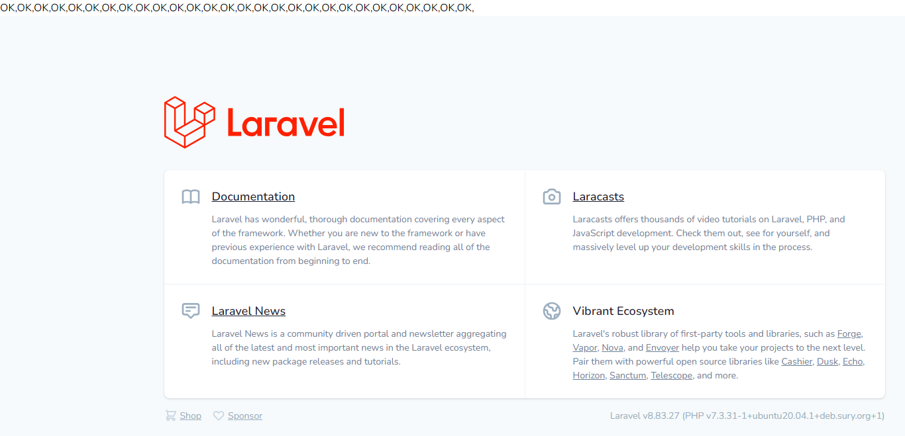

# 附录三：Container之resolve方法

源文件路径：vendor\laravel\framework\src\Illuminate\Container\Container.php

方法名：resolve

````php
/**
 * Resolve the given type from the container.
 *
 * @param  string  $abstract
 * @param  array  $parameters
 * @param  bool   $raiseEvents
 * @return mixed
 *
 * @throws \Illuminate\Contracts\Container\BindingResolutionException
 */
protected function resolve($abstract, $parameters = [], $raiseEvents = true)
{
    $abstract = $this->getAlias($abstract);

    $needsContextualBuild = ! empty($parameters) || ! is_null(
        $this->getContextualConcrete($abstract)
    );

    // If an instance of the type is currently being managed as a singleton we'll
    // just return an existing instance instead of instantiating new instances
    // so the developer can keep using the same objects instance every time.
    if (isset($this->instances[$abstract]) && ! $needsContextualBuild) {
        return $this->instances[$abstract];
    }

    $this->with[] = $parameters;

    $concrete = $this->getConcrete($abstract);

    // We're ready to instantiate an instance of the concrete type registered for
    // the binding. This will instantiate the types, as well as resolve any of
    // its "nested" dependencies recursively until all have gotten resolved.
    if ($this->isBuildable($concrete, $abstract)) {
        $object = $this->build($concrete);
    } else {
        $object = $this->make($concrete);
    }

    // If we defined any extenders for this type, we'll need to spin through them
    // and apply them to the object being built. This allows for the extension
    // of services, such as changing configuration or decorating the object.
    foreach ($this->getExtenders($abstract) as $extender) {
        $object = $extender($object, $this);
    }

    // If the requested type is registered as a singleton we'll want to cache off
    // the instances in "memory" so we can return it later without creating an
    // entirely new instance of an object on each subsequent request for it.
    if ($this->isShared($abstract) && ! $needsContextualBuild) {
        $this->instances[$abstract] = $object;
    }

    if ($raiseEvents) {
        $this->fireResolvingCallbacks($abstract, $object);
    }

    // Before returning, we will also set the resolved flag to "true" and pop off
    // the parameter overrides for this build. After those two things are done
    // we will be ready to return back the fully constructed class instance.
    $this->resolved[$abstract] = true;

    array_pop($this->with);

    return $object;
}  
````

resolve方法其实是Laravel框架容器类中make方法的核心实现：

```php
/**
 * Resolve the given type from the container.
 *
 * @param  string  $abstract
 * @param  array  $parameters
 * @return mixed
 *
 * @throws \Illuminate\Contracts\Container\BindingResolutionException
 */
public function make($abstract, array $parameters = [])
{
	return $this->resolve($abstract, $parameters);
}
```

读者可能会有疑问，从上面的代码来看，make似乎有点多余，直接调用resolve不就好了吗？大家可以仔细比较一下这两个方法的形参：

```php
public function make($abstract, array $parameters = [])
{
	return $this->resolve($abstract, $parameters);
}
```

```php
 /**
  * Resolve the given type from the container.
  *
  * @param  string  $abstract
  * @param  array  $parameters
  * @param  bool   $raiseEvents
  * @return mixed
  *
  * @throws \Illuminate\Contracts\Container\BindingResolutionException
  */
protected function resolve($abstract, $parameters = [], $raiseEvents = true)
{
	$abstract = $this->getAlias($abstract);
	...
	... ...
```

很容易看出来，make方法调用resolve时，并没有指定$raiseEvents的参数值，因此可以认为make方法解析实例时，$raiseEvents值就是true。这样我们就能理解了，make解析实例时，一定会去执行Container的fireResolvingCallbacks方法。那这个方法做了什么呢？

```php
/**
 * Fire all of the resolving callbacks.
 *
 * @param  string  $abstract
 * @param  mixed   $object
 * @return void
 */
protected function fireResolvingCallbacks($abstract, $object)
{
	$this->fireCallbackArray($object, $this->globalResolvingCallbacks);

	$this->fireCallbackArray(
		$object, $this->getCallbacksForType($abstract, $object, $this->resolvingCallbacks)
	);

	$this->fireAfterResolvingCallbacks($abstract, $object);
}
```

这个方法，实际就是触发执行绑定在解析对象上的回调事件。而回调事件，又分为几种：全局解析中事件，全局解析后事件，类解析中事件，类解析后事件，这些事件全部作为容器的保护成员定义在Container类中：

```php
/**
 * All of the registered rebound callbacks.
 *
 * @var array[]
 */
protected $reboundCallbacks = [];

/**
 * All of the global resolving callbacks.
 *
 * @var \Closure[]
 */
protected $globalResolvingCallbacks = [];

/**
 * All of the global after resolving callbacks.
 *
 * @var \Closure[]
 */
protected $globalAfterResolvingCallbacks = [];

/**
 * All of the resolving callbacks by class type.
 *
 * @var array[]
 */
protected $resolvingCallbacks = [];

/**
 * All of the after resolving callbacks by class type.
 *
 * @var array[]
 */
protected $afterResolvingCallbacks = [];
```

接下来我们通过一个实例来理解，解析对象上的回调事件是如何执行的：

新建一个新的Provider类型文件CuponServiceProvider.php，路径：vendor\laravel\framework\src\Illuminate\Foundation\Providers\CuponServiceProvider.php，源码如下：

```php
<?php

namespace Illuminate\Foundation\Providers;

use Illuminate\Routing\Redirector;
use Illuminate\Support\ServiceProvider;
use Illuminate\Foundation\Http\FormRequest;
use Illuminate\Contracts\Validation\ValidatesWhenResolved;

class CuponServiceProvider extends ServiceProvider
{
    /**
     * Register the service provider.
     *
     * @return void
     */
    public function register()
    {
        //
    }

    /**
     * Bootstrap the application services.
     *
     * @return void
     */
    public function boot()
    {

        $closure = function(){
        	echo 'OK,';
        };
        $this->app->resolving($closure, NULL);
    }
}

```

接下来，我们修改一下Application.php文件(vendor/laravel/framework/src/Illuminate/Foundation/Application.php)的代码：

在registerBaseServiceProviders方法中，加入刚刚我们新建的这个Provider文件的注册：

```php
/**
 * Register all of the base service providers.
 *
 * @return void
 */
protected function registerBaseServiceProviders()
{
	$this->register(new EventServiceProvider($this));
	$this->register(new LogServiceProvider($this));
	$this->register(new RoutingServiceProvider($this));
	$this->register(new CuponServiceProvider($this));
}
```

现在刷新一下首页：



> 要正确完成CuponServiceProvider类的引入，还需在文件按头部添加命名空间

我们看到页面输出了很多个"OK,"，这是因为在程序完成执行完`registerBaseServiceProvider`方法中的`$this->register(new CuponServiceProvider($this));`代码后，CuponServiceProvider类中的`boot`方法被调用，而这个方法正是完成了一次对全局回调事件($globalResolvingCallbacks)的操作，我们继续阅读容器类中的resolving方法源码：

```php
/**
 * Register a new resolving callback.
 *
 * @param  \Closure|string  $abstract
 * @param  \Closure|null  $callback
 * @return void
 */
public function resolving($abstract, Closure $callback = null)
{
	if (is_string($abstract)) {
		$abstract = $this->getAlias($abstract);
	}

	if (is_null($callback) && $abstract instanceof Closure) {
		$this->globalResolvingCallbacks[] = $abstract;
	} else {
		$this->resolvingCallbacks[$abstract][] = $callback;
	}
}
```

大家可以看到，这里我们的测试代码正好进入了上面代码中的这个if分支：

```
if (is_null($callback) && $abstract instanceof Closure) {
	$this->globalResolvingCallbacks[] = $abstract;
}
```

回到前面渲染出来的首页，为什么输出了这么多个"OK,"呢？

这正是因为，在完成`$this->register(new CuponServiceProvider($this));`这条语句之后，很多类的解析都是调用了`resolve`方法，并且调用`resolve`方法时，第三个参数$raiseEvents参数值是true。

至此，我们知道了在laravel框架中添加全局解析回调事件，以及触发回调事件执行的详细过程。依此类推，Container对象上的其他事件($reboundCallbacks、$globalAfterResolvingCallbacks、$resolvingCallbacks、$afterResolvingCallbacks)用法也类似。只是调用的方式和调用的时机可能不同，读者可自行探索。

回到resolve方法中，我们先来看第一行：

```php
$abstract = $this->getAlias($abstract);
```

继续追踪getAlias：

```php
/**
 * Get the alias for an abstract if available.
 *
 * @param  string  $abstract
 * @return string
 */
public function getAlias($abstract)
{
	if (! isset($this->aliases[$abstract])) {
	    return $abstract;
	}

	return $this->getAlias($this->aliases[$abstract]);
}
```

我们发现这里用了递归，代码试图去容器类保护成员变量aliases数组中查找$abstract键，如果没找到，直接返回$abstract。找到了，将值换成`$this->aliases[$abstract]`，请大家注意，`$this->aliases`数组中某个键的值(一般是一个字符串)很少会再成为$this->aliases的键名，即使有这种情况出现，也不会出现键名和键值相同的情况，因此这里的递归不会无限进行下去。

因此，这里程序优先去查看aliases数组中是否存在相应的键，如果不存在直接返回$abstract变量，否则返回的是alias数组相应键上的值。

接着看下面的代码：

```php
$needsContextualBuild = ! empty($parameters) || ! is_null(
	$this->getContextualConcrete($abstract)
);
```

接下来我们继续阅读这个方法后面的代码，可以得知，$needsContextualBuild是在判断根据当前的传参情况是否需要进行"上下文构建"。如何理解这个上下文构建呢？这就离不开Laravel的上下文绑定机制了。

什么是上下文呢？

> 每一段程序都有很多外部变量。只有像 Add 这种简单的函数才是没有外部变量的。一旦你的一段程序有了外部变量，这段程序就不完整，不能独立运行。你为了使他们运行，就要给所有的外部变量一个一个写一些值进去。这些值的集合就叫上下文。 

简单说，就是解析一个对象的时候，有些对象是需要外部的一些依赖的。那他在创建的时候就要用到"上下文"把依赖引入。

而上下文绑定的意思就是专门处理"实例化时候有依赖关系"情况的一种绑定。下面我们继续看Laravel官方给出的示例：

```php
use Illuminate\Support\Facades\Storage;
use App\Http\Controllers\PhotoController;
use App\Http\Controllers\VideoController;
use Illuminate\Contracts\Filesystem\Filesystem;

$this->app->when(PhotoController::class)
          ->needs(Filesystem::class)
          ->give(function () {
              return Storage::disk('local');
          });

$this->app->when(VideoController::class)
          ->needs(Filesystem::class)
          ->give(function () {
              return Storage::disk('s3');
          });
```

这是项目中常会用到存储功能，得益于 Laravel 内置集成了 FlySystem 的 Filesystem 接口，我们很容易实现多种存储服务的项目。
示例中将用户头像存储到本地，将用户上传的小视频存储到云服务。那么这个时就需要区分这样不同的使用场景（即上下文或者说环境）。
当用户存储头像（PhotoController::class）需要使用存储服务（Filesystem::class）时，我们将本地存储驱动，作为实现给到 PhotoController::class：

```php
function () {
    return Storage::disk('local');
}
```

而当用户上传视频 VideoController::class，需要使用存储服务（Filesystem::class）时，我们则将云服务驱动，作为实现给到 VideoController::class：

```php
function () {
    return Storage::disk('s3');
}
```

接下来我们看Laravel的源码实现：

1. when方法

   ```php
   public function when($concrete)
   {
       return new ContextualBindingBuilder($this, $this->getAlias($concrete));
   }
   ```

   这个方法直接生成一个ContextualBindingBuilder对象，传入container对象和$concrete。$concrete在这个例子中就是`PhotoController::class`和`VideoController::class`

2. ContextualBindingBuilder类

   ```php
   <?php
   
   namespace Illuminate\Container;
   
   use Illuminate\Support\Arr;
   use Illuminate\Contracts\Container\Container;
   use Illuminate\Contracts\Container\ContextualBindingBuilder as ContextualBindingBuilderContract;
   
   class ContextualBindingBuilder implements ContextualBindingBuilderContract
   {
       /**
        * The underlying container instance.
        *
        * @var \Illuminate\Contracts\Container\Container
        */
       protected $container;
   
       /**
        * The concrete instance.
        *
        * @var string|array
        */
       protected $concrete;
   
       /**
        * The abstract target.
        *
        * @var string
        */
       protected $needs;
   
       /**
        * Create a new contextual binding builder.
        *
        * @param  \Illuminate\Contracts\Container\Container  $container
        * @param  string|array  $concrete
        * @return void
        */
       public function __construct(Container $container, $concrete)
       {
           $this->concrete = $concrete;
           $this->container = $container;
       }
   
       /**
        * Define the abstract target that depends on the context.
        *
        * @param  string  $abstract
        * @return $this
        */
       public function needs($abstract)
       {
           $this->needs = $abstract;
   
           return $this;
       }
   
       /**
        * Define the implementation for the contextual binding.
        *
        * @param  \Closure|string  $implementation
        * @return void
        */
       public function give($implementation)
       {
           foreach (Arr::wrap($this->concrete) as $concrete) {
               $this->container->addContextualBinding($concrete, $this->needs, $implementation);
           }
       }
   }
   
   ```

   这个类主要提供两个方法，needs和give。needs方法就是简单把$abstract存储起来，然后返回当前对象，方便后面继续进行链式操作。give方法，重新调用$container的`addContextualBinding`方法，这个就是添加上下文绑定的方法，分别传入的下面三个参数：

   concrete：PhotoController::class的别名(如果有的话)

   abstruct：Filesytem::class

   implemention: 闭包 `Storage::disk('local');`的返回值

然后我们看一下Container中的`addContextualBinding`方法：

也很简单，就是把这些参数存入contextual数组。注意这里存储的形式：`contextual[PhotoController::class][Filesystem::class] = 闭包函数(也可以是一个类路径)`

```php
public function addContextualBinding($concrete, $abstract, $implementation)
{
	$this->contextual[$concrete][$this->getAlias($abstract)] = $implementation;
}
```

到这里，我们弄清楚了Laravel是如何处理上下文绑定的，总结如下：

当一个类实例化需要一些外部依赖的时候，就要用到上下文绑定。把外部依赖通过 need 传递给他。还可以通过 give 存储 when 对应的实现（针对抽象类或者接口甚至是子类）。存入到容器中那个负责上下文的那个数组中，这个数组将会在解析的时候 (就是取出某个对象的时候，他对应绑定的依赖也会被取出) 做判断。

现在我们重新回到resolve方法中：

```php
$needsContextualBuild = ! empty($parameters) || ! is_null(
        $this->getContextualConcrete($abstract)
    );
```

继续看getContextualConcrete方法源码：

```php
/**
 * Get the contextual concrete binding for the given abstract.
 *
 * @param  string  $abstract
 * @return \Closure|string|null
 */
protected function getContextualConcrete($abstract)
{
	if (! is_null($binding = $this->findInContextualBindings($abstract))) {
		return $binding;
	}

	// Next we need to see if a contextual binding might be bound under an alias of the
	// given abstract type. So, we will need to check if any aliases exist with this
	// type and then spin through them and check for contextual bindings on these.
	if (empty($this->abstractAliases[$abstract])) {
		return;
	}

	foreach ($this->abstractAliases[$abstract] as $alias) {
		if (! is_null($binding = $this->findInContextualBindings($alias))) {
			return $binding;
		}
	}
}
```

终于，我们看到这个方法内部调用的方法`findContextualBindings`和我们之前讲的"laravel中对上下文处理"的内容产生了交集：

```
protected function findInContextualBindings($abstract)
{
	return $this->contextual[end($this->buildStack)][$abstract] ?? null;
}
```

到这里为止，我们还只是讲完了上下文处理的部分，继续往后看：

```php
// If an instance of the type is currently being managed as a singleton we'll
// just return an existing instance instead of instantiating new instances
// so the developer can keep using the same objects instance every time.
if (isset($this->instances[$abstract]) && ! $needsContextualBuild) {
    return $this->instances[$abstract];
}

$this->with[] = $parameters;

$concrete = $this->getConcrete($abstract);

// We're ready to instantiate an instance of the concrete type registered for
// the binding. This will instantiate the types, as well as resolve any of
// its "nested" dependencies recursively until all have gotten resolved.
if ($this->isBuildable($concrete, $abstract)) {
    $object = $this->build($concrete);
} else {
    $object = $this->make($concrete);
}
```

第一个`if这里，是检测要解析的是不是一个单例对象，如果是则直接返回(从容器的instances数组中取，当前要解析的对象必须是无关上下文的)，然后将传递进来的参数保存在容器的保护成员with数组中。接着调用getConcrete方法：

```php
protected function getConcrete($abstract)
{
	if (! is_null($concrete = $this->getContextualConcrete($abstract))) {
		return $concrete;
	}

	// If we don't have a registered resolver or concrete for the type, we'll just
	// assume each type is a concrete name and will attempt to resolve it as is
	// since the container should be able to resolve concretes automatically.
	if (isset($this->bindings[$abstract])) {
		return $this->bindings[$abstract]['concrete'];
	}

	return $abstract;
}
```

这个方法的主要思路是：

- a) 看看上下文绑定数组中有没有$abstract对应的concrete值，如果有直接返回
- b) 如果没有找到上下文绑定，就是一个普通绑定，就取bindings数组中看看有没有$abstract对应的concrete值，从而确认是不是以前有绑定过。
- c) 都没有，说明没有绑定，直接返回$abstract

接下来，获取解析对象：

```php
if ($this->isBuildable($concrete, $abstract)) {
    $object = $this->build($concrete);
} else {
    $object = $this->make($concrete);
}
```

首先，我们看一下isBuildable方法是怎么判断的：

```php
protected function isBuildable($concrete, $abstract)
{
	return $concrete === $abstract || $concrete instanceof Closure;
}
```

$concrete和$abstract恒等或者$concrete是一个闭包

如果isBuildable返回true，执行build方法创建出这个object，build方法的处理是这样：

1）如果concrete是闭包，直接执行闭包函数

2）如果不是闭包，使用反射产生当前的$concrete类对象

如果isBuildable返回false，调用make进入递归，make 再去 getConcrete 函数，去上下文绑定数组和 binding 数组，查询这个时候这个・类路径下・（就是 abstruct）有没有对应的闭包或类路径。但不管怎么样。最后下来要么闭包，要么相等，他都会进入 build 函数创建对象。

至此，我们得到了解析出来的object对象。

继续看后面的代码：

```php
foreach ($this->getExtenders($abstract) as $extender) {
	$object = $extender($object, $this);
}

// If the requested type is registered as a singleton we'll want to cache off
// the instances in "memory" so we can return it later without creating an
// entirely new instance of an object on each subsequent request for it.
if ($this->isShared($abstract) && ! $needsContextualBuild) {
	$this->instances[$abstract] = $object;
}

if ($raiseEvents) {
	$this->fireResolvingCallbacks($abstract, $object);
}

// Before returning, we will also set the resolved flag to "true" and pop off
// the parameter overrides for this build. After those two things are done
// we will be ready to return back the fully constructed class instance.
$this->resolved[$abstract] = true;

array_pop($this->with);

return $object;
```

首先看是否有扩展extend的处理，执行：

```php
foreach ($this->getExtenders($abstract) as $extender) {
    $object = $extender($object, $this);
}
```

接下来，看是否是单例分享的，如果是的话就存入instance：

```php
if ($this->isShared($abstract) && ! $needsContextualBuild) {
    $this->instances[$abstract] = $object;
}
```

接着触发各个回调函数，执行回调，这一点在前面我们已经详细阐述过了：

```php
if ($raiseEvents) {
	$this->fireResolvingCallbacks($abstract, $object);
}
```

接着，标记$abstract已经解析，并且把参数从with中pop掉：

```php
$this->resolved[$abstract] = true;
array_pop($this->with);
```

最后返回对象：

```php
return $object;
```

> 本节内容部分参考自LearnKu社区，以下为转载详情：
> 作者：HarveyNorman
> 链接：https://learnku.com/articles/41092