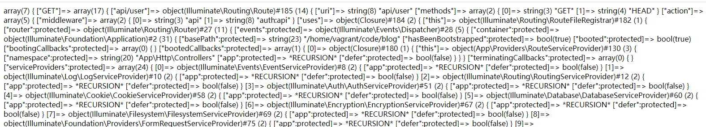

# 附录九：Route之findRoute方法

源文件路径：vendor\laravel\framework\src\Illuminate\Routing\Router.php

方法名：findRoute

```php
/**
 * Find the route matching a given request.
 *
 * @param  \Illuminate\Http\Request  $request
 * @return \Illuminate\Routing\Route
 */
protected function findRoute($request)
{
	$this->current = $route = $this->routes->match($request);

	$this->container->instance(Route::class, $route);

	return $route;
}
```

首先，我们看一下`findRoute`被调用的路径：

- index.php文件调用`make`方法创建Kernel对象（1）

```php
$kernel = $app->make(Illuminate\Contracts\Http\Kernel::class);
```

- 创建Kernel对象过程中，调用Kernel类的构造函数（2）

```php
public function __construct(Application $app, Router $router)
{
	$this->app = $app;
	$this->router = $router;

	$router->middlewarePriority = $this->middlewarePriority;

	foreach ($this->middlewareGroups as $key => $middleware) {
		$router->middlewareGroup($key, $middleware);
	}

	foreach ($this->routeMiddleware as $key => $middleware) {
		$router->aliasMiddleware($key, $middleware);
	}
}
```

- index.php文件执行Kernel对象的`handle`方法（3）

```php
$response = $kernel->handle(
    $request = Illuminate\Http\Request::capture()
);
```

- `handle`方法调用Kernel类的`sendRequestThroughRouter`方法（4）

  ```php
  public function handle($request)
  {
  	try {
  		$request->enableHttpMethodParameterOverride();
  
  		$response = $this->sendRequestThroughRouter($request);
  	} catch (Exception $e) {
  		$this->reportException($e);
  
  		$response = $this->renderException($request, $e);
  	} catch (Throwable $e) {
  		$this->reportException($e = new FatalThrowableError($e));
  
  		$response = $this->renderException($request, $e);
  	}
  
  	$this->app['events']->dispatch(
  		new Events\RequestHandled($request, $response)
  	);
  
  	return $response;
  }
  ```

  

- `sendRequestThroughRouter`方法调用`Pipeline`类的`then`方法，`then`方法继续调用Kernel类的`dispatchToRouter`方法（5）

  ```php
  protected function sendRequestThroughRouter($request)
  {
  	$this->app->instance('request', $request);
  
  	Facade::clearResolvedInstance('request');
  
  	$this->bootstrap();
  
  	return (new Pipeline($this->app))
  		->send($request)
  		->through($this->app->shouldSkipMiddleware() ? [] : $this->middleware)
  		->then($this->dispatchToRouter());
  }
  ```

  

  ```php
  protected function dispatchToRouter()
  {
  	return function ($request) {
  		$this->app->instance('request', $request);
  
  		return $this->router->dispatch($request);
  	};
  }
  ```

  

- `dispatchToRouter`方法调用Kernel类成员变量router上的`dispatch`方法（其实就是Router类的`dispatch`方法），`dispatch`方法又继续调用Router类的`dispatchToRoute`方法：（6）

  ```php
  public function dispatch(Request $request)
  {
  	$this->currentRequest = $request;
  
  	return $this->dispatchToRoute($request);
  }
  ```

  

  ```php
  public function dispatchToRoute(Request $request)
  {
  	return $this->runRoute($request, $this->findRoute($request));
  }
  ```

至此，我们在这一步终于看到`findRoute`实际是在调用`runRoute`方法时，先执行`findRoute`方法获得运行结果，然后将它作为参数值传递给`runRoute`方法的。

接下来我们来看`findRoute`方法的内部代码：

第一行`$this->current = $route = $this->routes->match($request);`，这里调用当前成员变量$routes身上的`match`方法，那么我们必然要去追踪$routes是什么：

通过搜索：routes（在Router类文件中），我们在Router类的构造函数中找到下面的代码：

```php
/**
 * Create a new Router instance.
 *
 * @param  \Illuminate\Contracts\Events\Dispatcher  $events
 * @param  \Illuminate\Container\Container|null  $container
 * @return void
 */
public function __construct(Dispatcher $events, Container $container = null)
{
	$this->events = $events;
	$this->routes = new RouteCollection;
	$this->container = $container ?: new Container;
}
```

这样我们就知道了，$routes是类RouteCollection的具体实例，那Router类又是什么时候创建的呢？

请读者回到本节开头仔细浏览(1) ~ (6)这6个过程中的代码，可以发现在(5)中出现了`$this->router->dispatch($request)`语句。这样，我们就发现了，router其实是Kernel类的一个成员变量，继续向前追踪可以发现在(2)中，Router是作为构造函数的参数在类的创建过程中被保存到成员变量router上的。

我们继续看`match`方法的源码：

```php
/**
 * Find the first route matching a given request.
 *
 * @param  \Illuminate\Http\Request  $request
 * @return \Illuminate\Routing\Route
 *
 * @throws \Symfony\Component\HttpKernel\Exception\NotFoundHttpException
 */
public function match(Request $request)
{
	$routes = $this->get($request->getMethod());

	// First, we will see if we can find a matching route for this current request
	// method. If we can, great, we can just return it so that it can be called
	// by the consumer. Otherwise we will check for routes with another verb.
	$route = $this->matchAgainstRoutes($routes, $request);

	if (! is_null($route)) {
		return $route->bind($request);
	}

	// If no route was found we will now check if a matching route is specified by
	// another HTTP verb. If it is we will need to throw a MethodNotAllowed and
	// inform the user agent of which HTTP verb it should use for this route.
	$others = $this->checkForAlternateVerbs($request);

	if (count($others) > 0) {
		return $this->getRouteForMethods($request, $others);
	}

	throw new NotFoundHttpException;
}
```

继续追踪`get`方法：

```php
/**
 * Get routes from the collection by method.
 *
 * @param  string|null  $method
 * @return array
 */
public function get($method = null)
{
	return is_null($method) ? $this->getRoutes() : Arr::get($this->routes, $method, []);
}
```

这里我们简单解释就是，获取对应$method参数值的所有route，返回route集合(以数组形式)

继续追踪`getRoutes`：

```php
/**
 * Get all of the routes in the collection.
 *
 * @return array
 */
public function getRoutes()
{
	return array_values($this->allRoutes);
}
```

我们看到，这里直接是取allRoutes成员变量中的值(这里我们猜测$this->allRoutes也是一个键值型数组)。

我们猜测，代码执行到这里时，$this->allRoutes和$this->routes一定是有值的，否则后面下面的`matchAgainstRoutes`方法如何能匹配

到路由呢？要验证这一点也很简单，我们对`RouteCollection`类的`match`方法，做简单的var_dump中断测试就可以了：

```php
/**
 * Find the first route matching a given request.
 *
 * @param  \Illuminate\Http\Request  $request
 * @return \Illuminate\Routing\Route
 *
 * @throws \Symfony\Component\HttpKernel\Exception\NotFoundHttpException
 */
public function match(Request $request)
{
    var_dump($this->routes);exit;
	//var_dump($this->getRoutes());exit;
	$routes = $this->get($request->getMethod());
	...
	... ...
```

输出结果截图：



> 注意第二个var_dump，打印的其实是$this->allRoutes的值。并且，大家在实际操作过程中会发现，这两次中断测试都会导致网页一直处于加载中的状态，随着时间的推移最终导致内存溢出。

现在问题来了：

- 在我们分析代码的过程中，根本就没有对`RouteCollection`类中的成员变量$routes和$allRoutes做任何操作，它们的值是从哪来的呢？
- 就算前面有对$routes和$allRoutes的操作，代码又是怎么做到这里获取到的值就是之前操作过的值呢？

要弄清楚这个问题，我们必须先弄清楚路由类的工作原理和工作过程：

>## 路由简介
>
>路由是外界访问Laravel应用程序的通路或者说路由定义了Laravel的应用程序向外界提供服务的具体方式：通过指定的URI、HTTP请求方法以及路由参数（可选）才能正确访问到路由定义的处理程序。无论URI对应的处理程序是一个简单的闭包还是说是控制器方法没有对应的路由外界都访问不到他们，今天我们就来看看Laravel是如何来设计和实现路由的。
>
>我们在路由文件里通常是向下面这样来定义路由的：
>
>```
>Route::get('/user', 'UsersController@index');
>```
>
>通过上面的路由我们可以知道，客户端通过以HTTP GET方式来请求 URI "/user"时，Laravel会把请求最终派发给UsersController类的index方法来进行处理，然后在index方法中返回响应给客户端。
>
>上面注册路由时用到的Route类在Laravel里叫门面（Facade），它提供了一种简单的方式来访问绑定到服务容器里的服务router，Facade的设计理念和实现方式我打算以后单开博文来写，在这里我们只要知道调用的Route这个门面的静态方法都对应服务容器里router这个服务的方法，所以上面那条路由你也可以看成是这样来注册的：
>
>```
>app()->make('router')->get('user', 'UsersController@index');
>
>```
>
>## 路由服务注册
>
>router这个服务是在实例化应用程序Application时在构造方法里通过注册RoutingServiceProvider时绑定到服务容器里的：
>
>```
>//bootstrap/app.php
>$app = new Illuminate\Foundation\Application(
>   realpath(__DIR__.'/../')
>   );
>
>//Application: 构造方法
>public function __construct($basePath = null)
>{
>if ($basePath) {
>	$this->setBasePath($basePath);
>}
>
>$this->registerBaseBindings();
>
>$this->registerBaseServiceProviders();
>
>$this->registerCoreContainerAliases();
>}
>
>//Application: 注册基础的服务提供器
>protected function registerBaseServiceProviders()
>{
>$this->register(new EventServiceProvider($this));
>
>$this->register(new LogServiceProvider($this));
>
>$this->register(new RoutingServiceProvider($this));
>}
>
>//\Illuminate\Routing\RoutingServiceProvider: 绑定router到服务容器
>protected function registerRouter()
>{
>$this->app->singleton('router', function ($app) {
>	return new Router($app['events'], $app);
>});
>}
>```
>
>通过上面的代码我们知道了Route调用的静态方法都对应于`\Illuminate\Routing\Router`类里的方法，Router这个类里包含了与路由的注册、寻址、调度相关的方法。
>下面我们从路由的注册、加载、寻址这几个阶段来看一下laravel里是如何实现这些的。
>
>## 路由加载
>
>注册路由前需要先加载路由文件，路由文件的加载是在`App\Providers\RouteServiceProvider`这个服务器提供者的boot方法里加载的:
>
>```
>class RouteServiceProvider extends ServiceProvider
>{
>public function boot()
>{
>	parent::boot();
>}
>
>public function map()
>{
>   $this->mapApiRoutes();
>
>   $this->mapWebRoutes();
>}
>
>protected function mapWebRoutes()
>{
>   Route::middleware('web')
>      ->namespace($this->namespace)
>      ->group(base_path('routes/web.php'));
>}
>
>protected function mapApiRoutes()
>{
>   Route::prefix('api')
>      ->middleware('api')
>      ->namespace($this->namespace)
>      ->group(base_path('routes/api.php'));
>}
>}
>```
>
>```
>namespace Illuminate\Foundation\Support\Providers;
>
>class RouteServiceProvider extends ServiceProvider
>{
>
>public function boot()
>{
>   $this->setRootControllerNamespace();
>
>   if ($this->app->routesAreCached()) {
>   	$this->loadCachedRoutes();
>   } else {
>   	$this->loadRoutes();
>
>       $this->app->booted(function () {
>             $this->app['router']->getRoutes()->refreshNameLookups();
>             $this->app['router']->getRoutes()->refreshActionLookups();
>         });
>   }
>	}
>
>protected function loadCachedRoutes()
>{
>   $this->app->booted(function () {
>   	require $this->app->getCachedRoutesPath();
>   });
>}
>
>protected function loadRoutes()
>{
>   if (method_exists($this, 'map')) {
>   	$this->app->call([$this, 'map']);
>   }
>}
>}
>
>class Application extends Container implements ApplicationContract, HttpKernelInterface
>{
>public function routesAreCached()
>{
>	return $this['files']->exists($this->getCachedRoutesPath());
>}
>
>public function getCachedRoutesPath()
>{
>	return $this->bootstrapPath().'/cache/routes.php';
>}
>}
>```
>
>laravel 首先去寻找路由的缓存文件，没有缓存文件再去进行加载路由。缓存文件一般在`bootstrap/cache/routes.php` 文件中。
>方法loadRoutes会调用map方法来加载路由文件里的路由，map这个函数在`App\Providers\RouteServiceProvider`类中，这个类继承自`Illuminate\Foundation\Support\Providers\RouteServiceProvider`。通过map方法我们能看到laravel将路由分为两个大组：api、web。这两个部分的路由分别写在两个文件中：routes/web.php、routes/api.php。
>Laravel5.5里是把路由分别放在了几个文件里，之前的版本是在app/Http/routes.php文件里。放在多个文件里能更方便地管理API路由和与WEB路由。
>
>## 路由注册
>
>我们通常都是用Route这个Facade调用静态方法get, post, head, options, put, patch, delete......等来注册路由，上面我们也说了这些静态方法其实是调用了Router类里的方法：
>
>```
>public function get($uri, $action = null)
>{
>	return $this->addRoute(['GET', 'HEAD'], $uri, $action);
>}
>
>public function post($uri, $action = null)
>{
>	return $this->addRoute('POST', $uri, $action);
>}
>```
>
>可以看到路由的注册统一都是由router类的addRoute方法来处理的：
>
>```
>//注册路由到RouteCollection
>protected function addRoute($methods, $uri, $action)
>{
>	return $this->routes->add($this->createRoute($methods, $uri, $action));
>}
>
>//创建路由
>protected function createRoute($methods, $uri, $action)
>{
>if ($this->actionReferencesController($action)) {
>   //controller@action类型的路由在这里要进行转换
>   $action = $this->convertToControllerAction($action);
>}
>
>$route = $this->newRoute(
>       $methods, $this->prefix($uri), $action
>       );
>
>if ($this->hasGroupStack()) {
>	$this->mergeGroupAttributesIntoRoute($route);
>}
>
>$this->addWhereClausesToRoute($route);
>
>return $route;
>}
>
>protected function convertToControllerAction($action)
>{
>if (is_string($action)) {
>	$action = ['uses' => $action];
>}
>
>if (! empty($this->groupStack)) {        
>	$action['uses'] = $this->prependGroupNamespace($action['uses']);
>}
>
>$action['controller'] = $action['uses'];
>
>return $action;
>}
>```
>
>注册路由时传递给addRoute的第三个参数action可以闭包、字符串或者数组，数组就是类似`['uses' => 'Controller@action', 'middleware' => '...]`这种形式的。如果action是Controller@action类型的路由将被转换为action数组, convertToControllerAction执行完后action的内容为：
>
>```
>[
>'uses' => 'App\Http\Controllers\SomeController@someAction',
>'controller' => 'App\Http\Controllers\SomeController@someAction'
>]
>```
>
>可以看到把命名空间补充到了控制器的名称前组成了完整的控制器类名，action数组构建完成接下里就是创建路由了，创建路由即用指定的HTTP请求方法、URI字符串和action数组来创建\Illuminate\Routing\Route类的实例:
>
>```
>protected function newRoute($methods, $uri, $action)
>{
>return (new Route($methods, $uri, $action))
>     ->setRouter($this)
>     ->setContainer($this->container);
>}
>```
>
>路由创建完成后将Route添加到RouteCollection中去：
>
>```
>protected function addRoute($methods, $uri, $action)
>{
>	return $this->routes->add($this->createRoute($methods, $uri, $action));
>}
>```
>
>router的$routes属性就是一个RouteCollection对象，添加路由到RouteCollection对象时会更新RouteCollection对象的routes、allRoutes、nameList和actionList属性。
>
>```
>class RouteCollection implements Countable, IteratorAggregate
>{
>public function add(Route $route)
>{
>   $this->addToCollections($route);
>
>   $this->addLookups($route);
>
>   return $route;
>}
>
>protected function addToCollections($route)
>{
>   $domainAndUri = $route->getDomain().$route->uri();
>
>   foreach ($route->methods() as $method) {
>   	$this->routes[$method][$domainAndUri] = $route;
>   }
>
>   $this->allRoutes[$method.$domainAndUri] = $route;
>}
>
>protected function addLookups($route)
>{
>   $action = $route->getAction();
>
>   if (isset($action['as'])) {
>       //如果时命名路由，将route对象映射到以路由名为key的数组值中方便查找
>       $this->nameList[$action['as']] = $route;
>   }
>
>   if (isset($action['controller'])) {
>   	$this->addToActionList($action, $route);
>   }
>}
>
>}
>```
>
>RouteCollection的四个属性
>routes中存放了HTTP请求方法与路由对象的映射：
>
>```
>[
>[
>   'GET' => [
>   $routeUri1 => $routeObj1
>   ...
>]
>	...
>]
>```
>
>allRoutes属性里存放的内容时将routes属性里的二位数组编程一位数组后的内容：
>
>```
>[
>'GET' . $routeUri1 => $routeObj1
>'GET' . $routeUri2 => $routeObj2
>...
>]
>```
>
>nameList是路由名称与路由对象的一个映射表：
>
>```
>[
>$routeName1 => $routeObj1
>...
>]
>```
>
>actionList是路由控制器方法字符串与路由对象的映射表：
>
>```
>[
>	'App\Http\Controllers\ControllerOne@ActionOne' => $routeObj1
>]
>```
>
>这样就算注册好路由了。
>
>## 路由寻址
>
>中间件的文章里我们说过HTTP请求在经过Pipeline通道上的中间件的前置操作后到达目的地：
>
>```
>//Illuminate\Foundation\Http\Kernel
>class Kernel implements KernelContract
>{
>protected function sendRequestThroughRouter($request)
>{
>   $this->app->instance('request', $request);
>
>   Facade::clearResolvedInstance('request');
>
>   $this->bootstrap();
>
>   return (new Pipeline($this->app))
>             ->send($request)
>             ->through($this->app->shouldSkipMiddleware() ? [] : $this->middleware)
>             ->then($this->dispatchToRouter());
>}
>
>protected function dispatchToRouter()
>{
>   return function ($request) {
>     $this->app->instance('request', $request);
>     return $this->router->dispatch($request);
>   };
>}
>
>}
>```
>
>上面代码可以看到Pipeline的destination就是dispatchToRouter函数返回的闭包：
>
>```
>$destination = function ($request) {
>$this->app->instance('request', $request);
>return $this->router->dispatch($request);
>};
>```
>
>在闭包里调用了router的dispatch方法，路由寻址就发生在dispatch的第一个阶段findRoute里：
>
>```
>class Router implements RegistrarContract, BindingRegistrar
>{    
>public function dispatch(Request $request)
>{
>   $this->currentRequest = $request;
>
>   return $this->dispatchToRoute($request);
>}
>
>public function dispatchToRoute(Request $request)
>{
>	return $this->runRoute($request, $this->findRoute($request));
>}
>
>protected function findRoute($request)
>{
>   $this->current = $route = $this->routes->match($request);
>
>   $this->container->instance(Route::class, $route);
>
>   return $route;
>}
>
>}
>```
>
>寻找路由的任务由 RouteCollection 负责，这个函数负责匹配路由，并且把 request 的 url 参数绑定到路由中：
>
>```
>class RouteCollection implements Countable, IteratorAggregate
>{
>public function match(Request $request)
>{
>	$routes = $this->get($request->getMethod());
>
>	$route = $this->matchAgainstRoutes($routes, $request);
>
>   if (! is_null($route)) {
>     //找到匹配的路由后，将URI里的路径参数绑定赋值给路由(如果有的话)
>   	return $route->bind($request);
>   }
>
>   $others = $this->checkForAlternateVerbs($request);
>
>   if (count($others) > 0) {
>   	return $this->getRouteForMethods($request, $others);
>   }
>
>   	throw new NotFoundHttpException;
>   }
>
>protected function matchAgainstRoutes(array $routes, $request, $includingMethod = true)
>{
>	return Arr::first($routes, function ($value) use ($request, $includingMethod) {
>		return $value->matches($request, $includingMethod);
>	});
>}
>}
>
>class Route
>{
>public function matches(Request $request, $includingMethod = true)
>{
>   $this->compileRoute();
>
>   foreach ($this->getValidators() as $validator) {
>       if (! $includingMethod && $validator instanceof MethodValidator) {
>       	continue;
>       }
>
>		if (! $validator->matches($this, $request)) {
>			return false;
>		}
>   }
>
>	return true;
>}
>}
>```
>
>$routes = $this->get($request->getMethod());会先加载注册路由阶段在RouteCollection里生成的routes属性里的值，routes中存放了HTTP请求方法与路由对象的映射。
>
>然后依次调用这堆路由里路由对象的matches方法， matches方法, matches方法里会对HTTP请求对象进行一些验证，验证对应的Validator是：UriValidator、MethodValidator、SchemeValidator、HostValidator。
>在验证之前在$this->compileRoute()里会将路由的规则转换成正则表达式。
>
>UriValidator主要是看请求对象的URI是否与路由的正则规则匹配能匹配上：
>
>```
>class UriValidator implements ValidatorInterface
>{
>	public function matches(Route $route, Request $request)
>	{
>		$path = $request->path() == '/' ? '/' : '/'.$request->path();
>
>		return preg_match($route->getCompiled()->getRegex(), rawurldecode($path));
>	}
>}
>```
>
>MethodValidator验证请求方法, SchemeValidator验证协议是否正确(http|https), HostValidator验证域名, 如果路由中不设置host属性，那么这个验证不会进行。
>
>一旦某个路由通过了全部的认证就将会被返回，接下来就要将请求对象URI里的路径参数绑定赋值给路由参数。
>
>## 路由参数绑定
>
>```
>class Route
>{
>public function bind(Request $request)
>{
>   $this->compileRoute();
>
>   $this->parameters = (new RouteParameterBinder($this))
>                 ->parameters($request);
>
>   return $this;
>}
>}	
>
>class RouteParameterBinder
>{
>public function parameters($request)
>{
>   $parameters = $this->bindPathParameters($request);
>
>   if (! is_null($this->route->compiled->getHostRegex())) {
>         $parameters = $this->bindHostParameters(
>             $request, $parameters
>         );
>	}
>
>		return $this->replaceDefaults($parameters);
>	}
>
>protected function bindPathParameters($request)
>{
>   preg_match($this->route->compiled->getRegex(), '/'.$request->decodedPath(), $matches);
>   return $this->matchToKeys(array_slice($matches, 1));
>}
>
>protected function matchToKeys(array $matches)
>{
>   if (empty($parameterNames = $this->route->parameterNames())) {
>       return [];
>   }
>
>   $parameters = array_intersect_key($matches, array_flip($parameterNames));
>
>   return array_filter($parameters, function ($value) {
>           return is_string($value) && strlen($value) > 0;
>       });
>}
>}
>```
>
>赋值路由参数完成后路由寻址的过程就结束了，结下来就该运行通过匹配路由中对应的控制器方法返回响应对象了。
>
>```
>class Router implements RegistrarContract, BindingRegistrar
>{    
>public function dispatch(Request $request)
>{
>   $this->currentRequest = $request;
>
>   return $this->dispatchToRoute($request);
>}
>
>public function dispatchToRoute(Request $request)
>{
>	return $this->runRoute($request, $this->findRoute($request));
>}
>
>protected function runRoute(Request $request, Route $route)
>{
>   $request->setRouteResolver(function () use ($route) {
>   	return $route;
>   });
>
>   $this->events->dispatch(new Events\RouteMatched($route, $request));
>
>   return $this->prepareResponse($request,
>   	$this->runRouteWithinStack($route, $request)
>   );
>	}
>
>protected function runRouteWithinStack(Route $route, Request $request)
>{
>   $shouldSkipMiddleware = $this->container->bound('middleware.disable') &&
>                     $this->container->make('middleware.disable') === true;
>   //收集路由和控制器里应用的中间件
>   $middleware = $shouldSkipMiddleware ? [] : $this->gatherRouteMiddleware($route);
>
>   return (new Pipeline($this->container))
>             ->send($request)
>             ->through($middleware)
>             ->then(function ($request) use ($route) {
>                 return $this->prepareResponse(
>                     $request, $route->run()
>                 );
>             });
>
>}
>
>}
>
>namespace Illuminate\Routing;
>class Route
>{
>public function run()
>{
>   $this->container = $this->container ?: new Container;
>   try {
>       if ($this->isControllerAction()) {
>       	return $this->runController();
>       }
>       return $this->runCallable();
>   } catch (HttpResponseException $e) {
>   	return $e->getResponse();
>   }
>}
>
>}
>```
>
>这里我们主要介绍路由相关的内容，runRoute的过程通过上面的源码可以看到其实也很复杂， 会收集路由和控制器里的中间件，将请求通过中间件过滤才会最终到达目的地路由，执行目的路由地run()方法，里面会判断路由对应的是一个控制器方法还是闭包然后进行相应地调用，最后把执行结果包装成Response对象返回给客户端。这个过程还会涉及到我们以前介绍过的中间件过滤、服务解析、依赖注入方面的信息，如果在看源码时有不懂的地方可以翻看我之前写的文章。
>
>————————————————
>版权声明：本文为CSDN博主「kevin_tech」的原创文章，遵循CC 4.0 BY-SA版权协议，转载请附上原文出处链接及本声明。
>原文链接：https://blog.csdn.net/kevin_tech/article/details/104093933


现在我们就来回答之前提到的两个问题：

1) $routes和$allRoutes值是从哪里来的？
2) 如何保证在`findRoute`方法运行时，调用的RouteCollection类自身$routes值和$allRoutes值就是之前操作过程中得到的值？

关键点在下面这个方法：

```php
protected function sendRequestThroughRouter($request)
{
	$this->app->instance('request', $request);

	Facade::clearResolvedInstance('request');

	$this->bootstrap();

	return (new Pipeline($this->app))
		    ->send($request)
		    ->through($this->app->shouldSkipMiddleware() ? [] : $this->middleware)
		    ->then($this->dispatchToRouter());
}
```

这个方法是Kernel类(vendor\laravel\framework\src\Illuminate\Foundation\Http\Kernel.php)的一个方法，它是index.php在执行$kernel对象的handle方法时触发的：

```php
public function handle($request)
{
    try {
        $request->enableHttpMethodParameterOverride();

        $response = $this->sendRequestThroughRouter($request);
    } catch (Exception $e) {
        $this->reportException($e);

        $response = $this->renderException($request, $e);
    } catch (Throwable $e) {
        $this->reportException($e = new FatalThrowableError($e));

        $response = $this->renderException($request, $e);
    }

    $this->app['events']->dispatch(
    	new Events\RequestHandled($request, $response)
    );

	return $response;
}
```

`sendRequestThroughRouter`方法中的关键语句`$this->bootstrap()`语句，会触发`\Illuminate\Foundation\Bootstrap\BootProviders`类上的`boostrap`方法运行，这个类的`bootstrap`方法实际就是触发容器运行`boot`方法；容器运行`boot`方法时，又会触发所有注册的ServiceProvider类型类运行自身的`boot`方法。

> Provider类的注册和加载进制，请参考【附录十一】

这样就触发了RouteServiceProvider(app/Providers/RouteServiceProvider.php)类上的`boot`方法执行：

```php
public function boot()
{
	//

	parent::boot();
}
```

这里，又再次指向了父类(Illuminate\Foundation\Support\Providers\RouteServiceProvider)的`boot`方法：

```php
public function boot()
{
	$this->setRootControllerNamespace();

	if ($this->routesAreCached()) {
		$this->loadCachedRoutes();
	} else {
		$this->loadRoutes();

		$this->app->booted(function () {
			$this->app['router']->getRoutes()->refreshNameLookups();
			$this->app['router']->getRoutes()->refreshActionLookups();
		});
	}
}
```

继续看`loadRoutes`方法：

```php
protected function loadRoutes()
{
	if (method_exists($this, 'map')) {
		$this->app->call([$this, 'map']);
	}
}
```

这样，又回到`App\Providers\RouteServiceProvider`的`map`方法：

```php
public function map()
{
	$this->mapApiRoutes();

	$this->mapWebRoutes();

	//
}
```

这里我们只需要分析其中一个方法即可，以mapWebRoutes为例：

```php
protected function mapWebRoutes()
{
	Route::middleware('web')
	     ->namespace($this->namespace)
	     ->group(base_path('routes/web.php'));
}
```

到这里，我们需要继续追踪`middleware`这个方法在哪个位置，我们知道代码中的Route实际是代理的Router类，但是Router类中并没有`middleware`这个静态方法，这是怎么回事呢？

要弄清楚这一点，我们需要对laravel中的Macroable这个trait有清晰的的认识。我们注意到，Router类的源码中包含下面的部分：

```php
class Router implements RegistrarContract, BindingRegistrar
{
	use Macroable {
		__call as macroCall;
	}
	...
	... ...
	
	public function __call($method, $parameters)
    {
        if (static::hasMacro($method)) {
            return $this->macroCall($method, $parameters);
        }

        if ($method === 'middleware') {
            return (new RouteRegistrar($this))->attribute($method, is_array($parameters[0]) ? $parameters[0] : $parameters);
        }

        return (new RouteRegistrar($this))->attribute($method, $parameters[0]);
    }
}
```

现在笔者简单解释一下，包含上面这个两个部分的代码后，发生了什么：

1）首先Macroable中定义的所有方法会自动对Router类生效

2）由于Macroable中也定义了一个\_\_call方法，因此将Macroable中的\_\_call方法取一个别名为`macroCall` ，供本类代码调用

这样当调用middleware时，代码会进入__call中的第二个if分支(注意：\_\_call实际是php类中的保留方法(也称魔术方法)，当调用的方法在类中没有定义时，会自动进入这个方法中)。这样我们就清楚了，接下来我们要去追踪`RouteRegistrar`类的`attribute`方法：

```php
public function attribute($key, $value)
{
	if (! in_array($key, $this->allowedAttributes)) {
		throw new InvalidArgumentException("Attribute [{$key}] does not exist.");
	}

	$this->attributes[Arr::get($this->aliases, $key, $key)] = $value;

	return $this;
}
```

这个方法返回的是RouteRegistrar对象本身，之后的链接调用语句来到这里：`->namespace($this->namespace)`，此时代码会进入`RouteRegistrar`类的\_\_call方法中(因为`RouteRegistrar`类没有定义这个`namespace`方法)：

```php
public function __call($method, $parameters)
{
	if (in_array($method, $this->passthru)) {
		return $this->registerRoute($method, ...$parameters);
	}

	if (in_array($method, $this->allowedAttributes)) {
		if ($method === 'middleware') {
			return $this->attribute($method, is_array($parameters[0]) ? $parameters[0] : $parameters);
		}

			return $this->attribute($method, $parameters[0]);
	}

    throw new BadMethodCallException(sprintf(
    	'Method %s::%s does not exist.', static::class, $method
    ));
}
```

代码进入第二个if分支，仍然调用的是`RouteRegistrar`类的`attribute`方法，接下来链式调用语句来到最后一句：`->group(base_path('routes/web.php'))`，继续追踪`RouteRegistrar`的group方法：

```php
public function group($callback)
{
	$this->router->group($this->attributes, $callback);
}
```

到这里，我们终于看到执行`mapWebRoutes`方法的终点，实际是调用`Router`类自身的`group`方法：

```php
public function group(array $attributes, $routes)
{
	$this->updateGroupStack($attributes);

	// Once we have updated the group stack, we'll load the provided routes and
	// merge in the group's attributes when the routes are created. After we
	// have created the routes, we will pop the attributes off the stack.
	$this->loadRoutes($routes);

	array_pop($this->groupStack);
}
```

继续追踪`loadRoutes`方法：

```php
protected function loadRoutes($routes)
{
	if ($routes instanceof Closure) {
		$routes($this);
	} else {
		(new RouteFileRegistrar($this))->register($routes);
	}
}
```

我们知道，此时传递进来的$routes参数值是一个路由文件的路径，并不是闭包，因此代码进入else分支，继续追踪`RouteFileRegistrar`类的`register`方法：

```php
/**
 * Require the given routes file.
 *
 * @param  string  $routes
 * @return void
 */
public function register($routes)
{
	$router = $this->router;

	require $routes;
}
```

终于，我们看到路由文件被直接require了。

当路由文件被`require`之后，路由文件中的php代码会逐条运行，我们以最常见的`get`、`post`来举例：

```php
Route::get('/profile', 'TestController@profile');
Route::post('/profile', 'TestController@profile');
```

直接看Router类的get和post方法源码：

```php
public function get($uri, $action = null)
{
	return $this->addRoute(['GET', 'HEAD'], $uri, $action);
}

public function post($uri, $action = null)
{
	return $this->addRoute('POST', $uri, $action);
}
```

这两个方法都指向`addRoute`：

```php
public function addRoute($methods, $uri, $action)
{
	return $this->routes->add($this->createRoute($methods, $uri, $action));
}
```

继续追踪`add`:

```php
public function add(Route $route)
{
    $this->addToCollections($route);

    $this->addLookups($route);

    return $route;
}	
```

继续追踪`addToCollections`：

```php
protected function addToCollections($route)
{
	$domainAndUri = $route->getDomain().$route->uri();

	foreach ($route->methods() as $method) {
		$this->routes[$method][$domainAndUri] = $route;
	}

	$this->allRoutes[$method.$domainAndUri] = $route;
}
```

到这里，大家应该能很清楚地看到，路由加载过程中，$routes和$allRoutes变量值是怎样被赋值的了。

剩下的另一个问题是：如何保证在`findRoute`方法运行时，调用的RouteCollection类自身$routes值和$allRoutes值就是之前操作过程中得到的值？

答案：Laravel通过操作一个单例Router来保证所有操作都在同一个Router对象上，既然是对同一个对象进行的操作，那这个对象的成员变量值自然在操作的各个阶段都能保持一致了。

要明白这一点，我们需要回退到容器的实例化阶段：

在app.php文件(bootstrap/app.php)中执行下面这一行代码时：

```php
$app = new Illuminate\Foundation\Application(
    $_ENV['APP_BASE_PATH'] ?? dirname(__DIR__)
);
```

会触发Application类的构造函数运行：

```php
public function __construct($basePath = null)
{
	if ($basePath) {
		$this->setBasePath($basePath);
	}

	$this->registerBaseBindings();
	$this->registerBaseServiceProviders();
	$this->registerCoreContainerAliases();
}
```

在`$this->registerBaseServiceProviders()`阶段：

```php
protected function registerBaseServiceProviders()
{
	$this->register(new EventServiceProvider($this));
	$this->register(new LogServiceProvider($this));
	$this->register(new RoutingServiceProvider($this));
}
```

最后这条语句：`$this->register(new RoutingServiceProvider($this));`会触发运行`RoutingServiceProvider`类自身的`register`方法：

```php
public function register()
{
    $this->registerRouter();
    $this->registerUrlGenerator();
    $this->registerRedirector();
    $this->registerPsrRequest();
    $this->registerPsrResponse();
    $this->registerResponseFactory();
    $this->registerControllerDispatcher();
}
```

这个方法中的第一句：`$this->registerRouter();`

```php
protected function registerRouter()
{
	$this->app->singleton('router', function ($app) {
	    return new Router($app['events'], $app);
	});
}
```

这就是典型的单例形式的绑定，表示容器会共享这个对象。容器在实例化阶段，完成了router类的注册。那在调用阶段中，确保了传递

的都是同一个router吗？

现在我们验证两个调用Router类的地方：

1）Kernel类中的成员变量$router

2）自定义路由的路由文件中引用的`Route`类

对1），Kernel类中的成员变量router值，实际是在构造函数中进行赋值操作的：

```php
public function __construct(Application $app, Router $router)
{
	$this->app = $app;
	$this->router = $router;

	$router->middlewarePriority = $this->middlewarePriority;

	foreach ($this->middlewareGroups as $key => $middleware) {
		$router->middlewareGroup($key, $middleware);
	}

	foreach ($this->routeMiddleware as $key => $middleware) {
		$router->aliasMiddleware($key, $middleware);
	}
}
```

这里的Kernel类在实例化时，创建出来的router对象就是容器中共享的实例router吗？

答案是肯定的。大家可以回顾一下`make`方法调用的`resolve`方法（见【附录三】）的源码。`singleton`方式注册的类make时是直接返回instance中保存的值的。

那路由文件中的引用的Route，是不是也指向共享实例router呢？

比如：`Route::get('/profile', 'TestController@profile');`

要搞清楚这里，需要大家对Laravel中的Facade机制有深入的理解。由于Route是代理的Router类，在Facade机制下，调用`Route::get()`时，会从Facade类中的app(指向全局容器对象)对象上获取router键值，这个router键的值正好是容器实例化阶段绑定上去的Router类。

到目前为止，我们只讲清楚了RouteCollection类中`match`方法的第一行代码：

```php
public function match(Request $request)
{
	$routes = $this->get($request->getMethod());

	// First, we will see if we can find a matching route for this current request
	// method. If we can, great, we can just return it so that it can be called
	// by the consumer. Otherwise we will check for routes with another verb.
	$route = $this->matchAgainstRoutes($routes, $request);

	if (! is_null($route)) {
		return $route->bind($request);
	}

	// If no route was found we will now check if a matching route is specified by
	// another HTTP verb. If it is we will need to throw a MethodNotAllowed and
	// inform the user agent of which HTTP verb it should use for this route.
	$others = $this->checkForAlternateVerbs($request);

	if (count($others) > 0) {
		return $this->getRouteForMethods($request, $others);
	}

	throw new NotFoundHttpException;
}
```

这个方法中的第二条语句：`$route = $this->matchAgainstRoutes($routes, $request);`，才是`findRoute`方法的核心，根据当前request请求匹配到一条路由。

直接进入`matchAgainstRoutes`方法：

```php
protected function matchAgainstRoutes(array $routes, $request, $includingMethod = true)
{
	[$fallbacks, $routes] = collect($routes)->partition(function ($route) {
		return $route->isFallback;
	});

	return $routes->merge($fallbacks)->first(function ($value) use ($request, $includingMethod) {
		return $value->matches($request, $includingMethod);
	});
}
```

在这个方法中，我们重点关注`matches`方法，通过分析我们知道这个matches方法应该是Route类(vendor\laravel\framework\src\Illuminate\Routing\Route.php)中的方法：

```php
public function matches(Request $request, $includingMethod = true)
{
	$this->compileRoute();

	foreach ($this->getValidators() as $validator) {
		if (! $includingMethod && $validator instanceof MethodValidator) {
			continue;
		}

		if (! $validator->matches($this, $request)) {
			return false;
		}
	}

	return true;
}
```

> compileRoute方法底层是调用SymfonyRoute类构造出一个compile实例，然后赋值给本类的成员变量compiled。

继续追踪`getValidators`方法中获取的`Validator`，我们就能看到这个方法中的核心方法`matches`是怎么工作的了。

以`UrlValidator`为例：

```php
public function matches(Route $route, Request $request)
{	
	$path = $request->path() === '/' ? '/' : '/'.$request->path();

	return preg_match($route->getCompiled()->getRegex(), rawurldecode($path));
}
```

到这里，我们终于讲完了`findRoute`涉及到的所有代码。