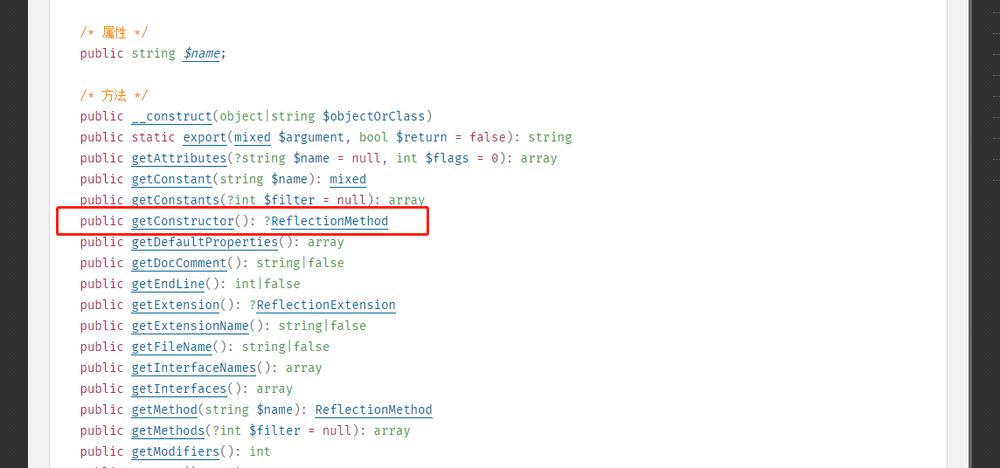
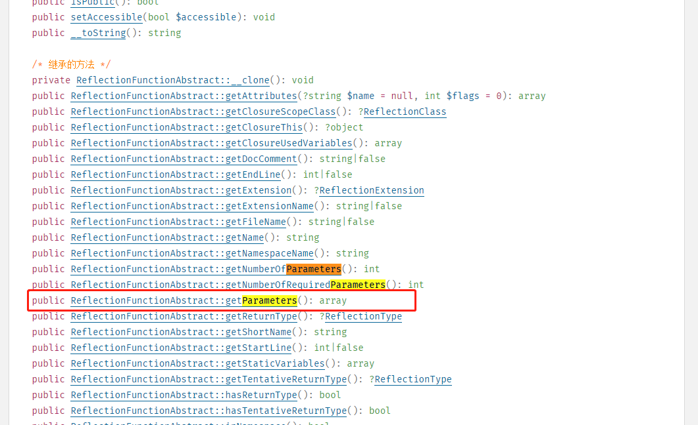
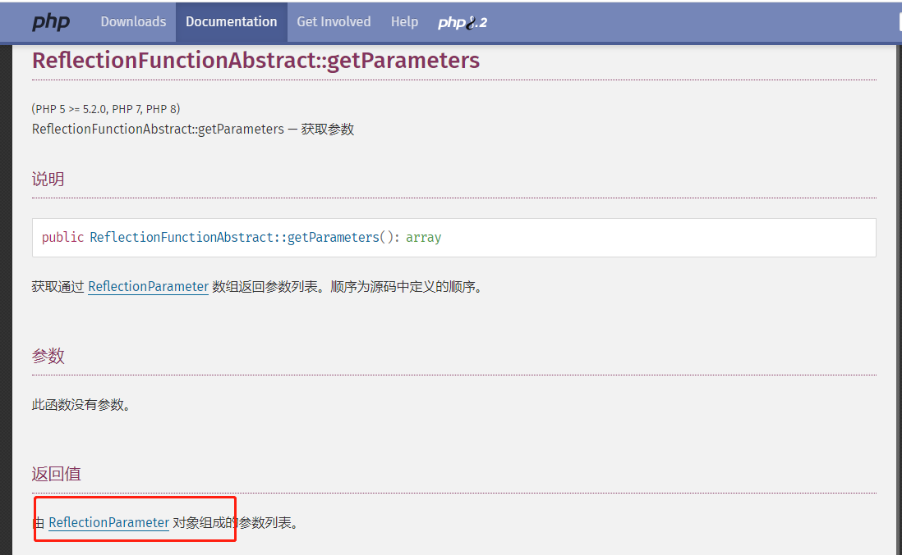

# 附录五：Container之resolveDependencies方法

源文件路径：vendor\laravel\framework\src\Illuminate\Container\Container.php

方法名：resolveDependencies

````php
/**
 * Resolve all of the dependencies from the ReflectionParameters.
 *
 * @param  array  $dependencies
 * @return array
 *
 * @throws \Illuminate\Contracts\Container\BindingResolutionException
 */
protected function resolveDependencies(array $dependencies)
{
    $results = [];

    foreach ($dependencies as $dependency) {
        // If this dependency has a override for this particular build we will use
        // that instead as the value. Otherwise, we will continue with this run
        // of resolutions and let reflection attempt to determine the result.
        if ($this->hasParameterOverride($dependency)) {
            $results[] = $this->getParameterOverride($dependency);

            continue;
        }

        // If the class is null, it means the dependency is a string or some other
        // primitive type which we can not resolve since it is not a class and
        // we will just bomb out with an error since we have no-where to go.
        $results[] = is_null($dependency->getClass())
            ? $this->resolvePrimitive($dependency)
            : $this->resolveClass($dependency);
    }

    return $results;
}
````

首先我们需要清楚的是，$dependencies是通过反射的方式获取到的对象构造函数需要的参数值。由于参数值可能很多，因此这里是传递的数组。但是这个数组大家需要注意的是，每个数组中的元素，并不是简单的字符串类型的值，而是对象类型的值。那这个对象的类型是什么呢？

首先需要追溯$dependencies是怎么产生的：

```php
$reflector = new ReflectionClass($concrete);
  
if (! $reflector->isInstantiable()) {
    return $this->notInstantiable($concrete);
}

$this->buildStack[] = $concrete;

$constructor = $reflector->getConstructor();

if (is_null($constructor)) {
    array_pop($this->buildStack);
    return new $concrete;
}

$dependencies = $constructor->getParameters();
try {
    $instances = $this->resolveDependencies($dependencies);
} catch (BindingResolutionException $e) {
    ...
    ... ...
```

上面这段代码正是调用`resolveDependencies`方法前，`build`方法中的核心代码。可以看到，$dependencies是反射类的构造器通过调用`getParameters`方法获取到的值，继续追溯getConstructor方法：

大家可以查看php的在线手册，在这个页面：https://www.php.net/manual/zh/class.reflectionclass.php，包含了ReflectionClass能调用的所有方法：



可以看到，`getConstructor`方法返回的是ReflectionMethod类型的值。

于是我们继续找到ReflectionMethod的手册页面(https://www.php.net/manual/zh/class.reflectionmethod.php)，找到`getParameters`方法：



点进去仔细查看这个页面的说明：



至此，我们可以确定，$dependencies数组中的元素类型，是ReflectionParameter类。这一点，和后面我们看到的`resolvePreimitive`方法中给出的形参类型一致。

弄清楚这一点，我们才能知道，当后面的代码出现`$dependency->name`，`$dependency->getClass()`，以及`$parameter->isDefaultValueAvailable()`和`$parameter->getDefaultValue()`、`$parameter->isOptional()`、`$parameter->getClass()->name`时，究竟发生了什么。

接下来我们继续看源码：

```php
 foreach ($dependencies as $dependency) {
    // If this dependency has a override for this particular build we will use
    // that instead as the value. Otherwise, we will continue with this run
    // of resolutions and let reflection attempt to determine the result.
    if ($this->hasParameterOverride($dependency)) {
		$results[] = $this->getParameterOverride($dependency);

		continue;
    }

    // If the class is null, it means the dependency is a string or some other
    // primitive type which we can not resolve since it is not a class and
    // we will just bomb out with an error since we have no-where to go.
    $results[] = is_null($dependency->getClass())
		    ? $this->resolvePrimitive($dependency)
		    : $this->resolveClass($dependency);
```

这里是直接遍历整个数组，然后使用方法`$this->hasParameterOverride($dependency)`判断是否存在参数覆盖，我们看一下`hasParameterOverride`方法的源码：

```php
protected function hasParameterOverride($dependency)
{
	return array_key_exists(
		$dependency->name, $this->getLastParameterOverride()
	);
}
```

`getLastParameterOverride`是获取make时候存入with数组的参数。如果有覆盖，就将`$this->getParameterOverride($dependency)`中的值存入result数组，中断本次循环继续执行下一次循环。我们继续看一下`getParameterOverride`方法的源码：

```php
protected function getParameterOverride($dependency)
{
	return $this->getLastParameterOverride()[$dependency->name];
}
```

还是通过 `getLastParameterOverride `获取 with 数组，然后在数组中通过 name获取。

如果`hasParameterOverride`方法返回值为false，判断这个类是不是存在于当前代码中，如果不存在，则使用`resolvePrimitive`方法，看看上下文绑定中有没有对应的值，再看看依赖自己有没有默认值。如果存在则使用`resolveClass`方法，就是使用make函数解析这个依赖。

resolvePrimitive：

```php
protected function resolvePrimitive(ReflectionParameter $parameter)
{
	if (! is_null($concrete = $this->getContextualConcrete('$'.$parameter->name))) {
		return $concrete instanceof Closure ? $concrete($this) : $concrete;
	}

	if ($parameter->isDefaultValueAvailable()) {
		return $parameter->getDefaultValue();
	}

	$this->unresolvablePrimitive($parameter);
}
```

注意这个方法中参数$parameter的类型是：**ReflectionParameter**，我们在本节的前面已经给大家分析过怎样确定$parameter变量的的类型。

resolveClass：

```php
protected function resolveClass(ReflectionParameter $parameter)
{
	try {
		return $this->make($parameter->getClass()->name);
	}

	// If we can not resolve the class instance, we will check to see if the value
	// is optional, and if it is we will return the optional parameter value as
	// the value of the dependency, similarly to how we do this with scalars.
	catch (BindingResolutionException $e) {
		if ($parameter->isOptional()) {
			return $parameter->getDefaultValue();
		}

		throw $e;
	}
}
```

`resolveDependencies`方法源自Container类的`build`方法，而`build`又是核心方法`resolve`中调用的一个子方法。这个方法之所以命名为resolveDependencies，正是因为Laravel框架底层实现"依赖注入"的方式就是使用PHP5之后出现的反射。实际上，使用反射来构建类，必然绕不过循环。因为通过反射提供的相关方法，只能获取到构造函数的参数列表，由于参数列表中的参数数目和参数类型是不确定的，这里只能通过循环去做处理。

下面是另一个处理"依赖注入"的典型方式：

```php
<?php

class Dependence1 {
    function foo() {
        echo "foo";
    }
}

class Dependence2 {
    function foo2() {
        echo "foo2";
    }
}

final class myClass
{
    private $dep1;
    private $dep2;

    public function __construct(
        Dependence1 $dependence1, 
        Dependence2 $dependence2
    )
    {
        $this->dep1 = $dependence1;
        $this->dep2 = $dependence2;        
    }
    
}

$constructor = new ReflectionMethod(myClass::class, '__construct');
$parameters = $constructor->getParameters();

$dependences = [];
foreach ($parameters as $parameter) {
    $dependenceClass = (string) $parameter->getType();
    $dependences[] = new $dependenceClass();
}

$instance = new myClass(...$dependences);
var_dump($instance);
```

这段代码的运行结果如下：

```php
object(myClass)#6 (2) {
  ["dep1":"myClass":private]=>
  object(Dependence1)#4 (0) {
  }
  ["dep2":"myClass":private]=>
  object(Dependence2)#5 (0) {
  }
}
```

